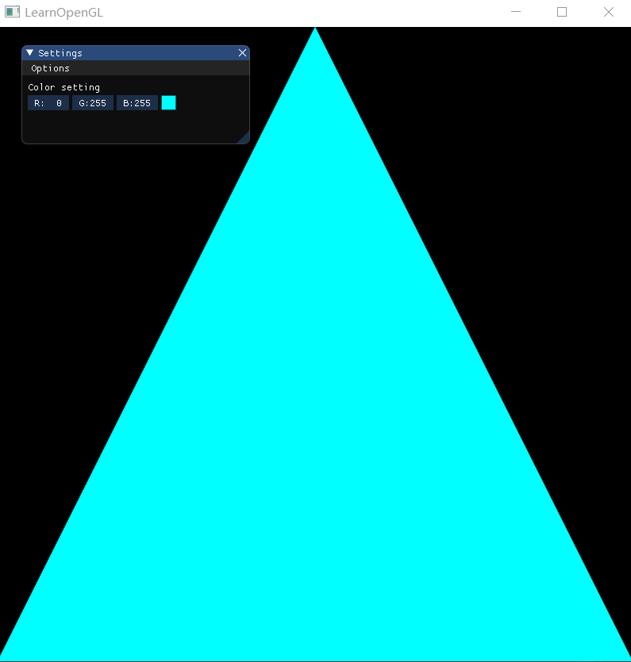
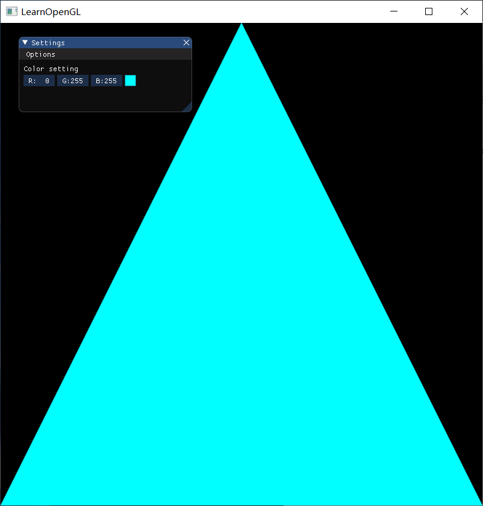
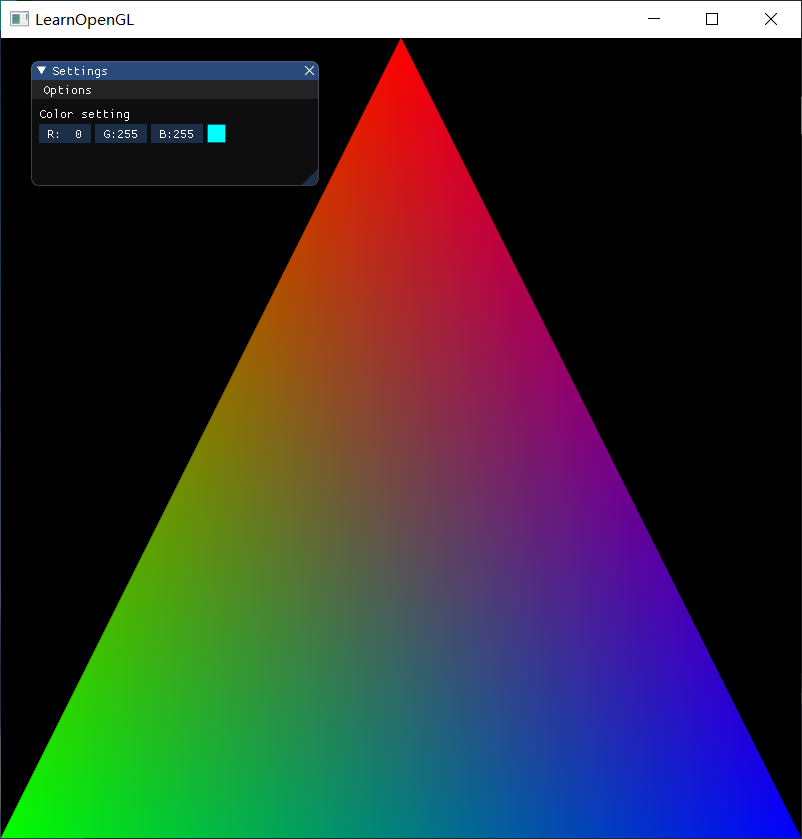
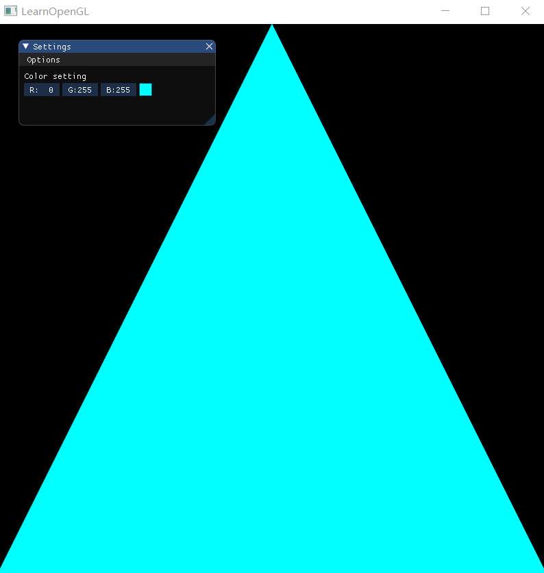
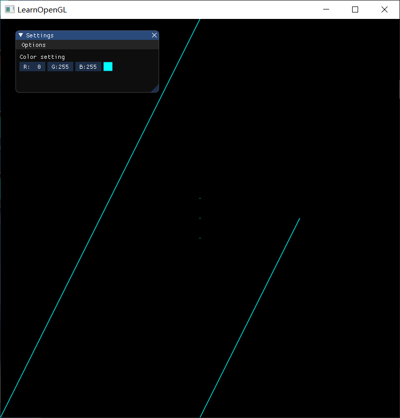
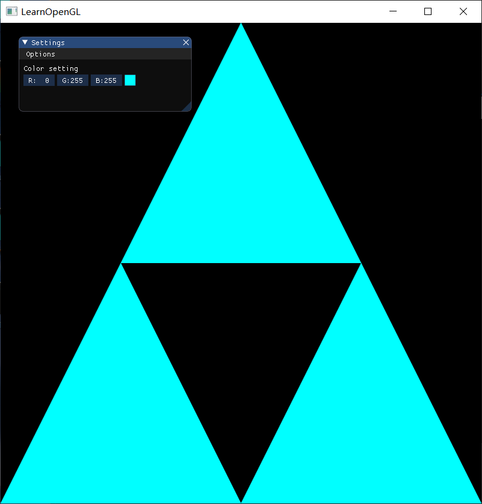
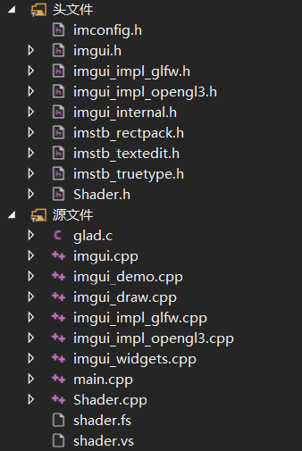
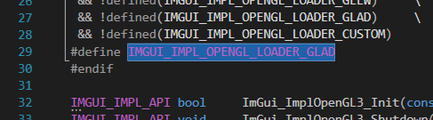

# Homework 2 - GUI and Draw simple graphics

## 1 Basic

### 1.0 整体效果

点击Options下拉菜单，可以按题号选择渲染



### 1.1 使用OpenGL(3.3及以上)+GLFW或freeglut画一个简单的三角形



### 1.2 对三角形的三个顶点分别改为红绿蓝，并解释为什么会出现这样的结果



#### 1.2.1 解释结果

我们只提供了3个颜色，这是在片段着色器中进行的所谓片段插值(Fragment Interpolation)的结果。当渲染一个三角形时，光栅化(Rasterization)阶段通常会造成比原指定顶点更多的片段。光栅会根据每个片段在三角形形状上所处相对位置决定这些片段的位置。

基于这些位置，它会插值(Interpolate)所有片段着色器的输入变量。比如说，我们有一个线段，上面的端点是绿色的，下面的端点是蓝色的。如果一个片段着色器在线段的70%的位置运行，它的颜色输入属性就会是一个绿色和蓝色的线性结合；更精确地说就是30%蓝 + 70%绿。

这正是在这个三角形中发生了什么。我们有3个顶点，和相应的3个颜色，从这个三角形的像素来看它可能包含50000左右的片段，片段着色器为这些像素进行插值颜色。如果你仔细看这些颜色就应该能明白了：红首先变成到紫再变为蓝色。片段插值会被应用到片段着色器的所有输入属性上。

### 1.3 给上述工作添加一个GUI，里面有一个菜单栏，使得可以选择并改变三角形的颜色




## 2 Bonus

### 2.1 绘制其他的图元，除了三角形，还有点、线等。



### 2.2 使用EBO(Element Buffer Object)绘制多个三角形。




## 3 作业要求

1. 把运行结果截图贴到报告里，并回答作业里提出的问题。
2. 报告里简要说明实现思路，以及主要function/algorithm的解释。


## 4 实现思路

### 4.1 创建窗口

在绘制图形之前，首要初始化一些参数，并创建窗口，实现过程与各函数解释见以下代码注释。

```c++
glfwInit();	// 初始化GLFW

// 告诉GLFW我们要使用的OpenGL版本是3.3
glfwWindowHint(GLFW_CONTEXT_VERSION_MAJOR, 3);	// 主版本号(Major)设为3
glfwWindowHint(GLFW_CONTEXT_VERSION_MINOR, 3);	// 次版本号(Minor)设为3

// 明确告诉GLFW我们使用的是核心模式(Core-profile)
glfwWindowHint(GLFW_OPENGL_PROFILE, GLFW_OPENGL_CORE_PROFILE);

// 窗口的宽和高作为它的前两个参数, 第三个参数表示这个窗口的名称（标题）
GLFWwindow* window = glfwCreateWindow(SCR_WIDTH, SCR_HEIGHT, "LearnOpenGL", NULL, NULL);
if (window == NULL) {
	std::cout << "Failed to create GLFW window" << std::endl;
	glfwTerminate();
	return -1;
}
// 通知GLFW将我们窗口的上下文设置为当前线程的主上下文
glfwMakeContextCurrent(window);
glfwSwapInterval(1); // Enable vsync

// 在调用任何OpenGL的函数之前我们需要初始化GLAD
if (!gladLoadGLLoader((GLADloadproc)glfwGetProcAddress)) {
	std::cout << "Failed to initialize GLAD" << std::endl;
	return -1;
}

// 注册这个函数，告诉GLFW我们希望每当窗口调整大小的时候调用这个函数
glfwSetFramebufferSizeCallback(window, framebuffer_size_callback);
```

### 4.2 编写顶点着色器、片段着色器，并编译、链接为着色器程序

参照教程[着色器](https://learnopengl-cn.github.io/01%20Getting%20started/05%20Shaders/#_1)，编写着色器类`Shader`，从硬盘读取着色器，然后编译并链接它们，并对它们进行错误检测。顶点着色器和片段着色器的代码分别位于`shader.vs`和`shader.fs`中，着色器编写使用的是GLSL（OpenGL Shading Language），这是一种类似于C的语言，用来编写OpenGL着色器。

以下是`Shader`类的声明

```c++
#pragma once

#include <glad/glad.h>
#include <string>
#include <fstream>
#include <sstream>
#include <iostream>

class Shader
{
public:
	// 构造器读取并构建着色器
	Shader(const GLchar* vertexPath, const GLchar* fragmentPath);
	~Shader();

	// 程序ID
	unsigned int ID;

	// 使用/激活程序 activate the shader
	void use();
	// uniform 工具函数 utility uniform functions
	void setBool(const std::string &name, bool value) const;
	void setInt(const std::string &name, int value) const;
	void setFloat(const std::string &name, float value) const;

private:
	// utility function for checking shader compilation/linking errors.
	void checkCompileErrors(unsigned int shader, std::string type);
};
```

### 4.3 ImGui配置与使用

#### 4.3.1 配置ImGui

下载ImGui (在releases里面下载源代码包，这里下载imgui-1.68)：https://github.com/ocornut/imgui

首先把`imgui-1.68`文件夹下的`.h`文件和`.cpp`文件都加入到项目中



ImGui的OpenGL3的example程序在`imgui-1.68/example_glfw_opengl3/main.cpp`中，这个文件是重要的参考文件，里面的开头是这样的：

```c++
// dear imgui: standalone example application for GLFW + OpenGL 3, using programmable pipeline
// If you are new to dear imgui, see examples/README.txt and documentation at the top of imgui.cpp.
// (GLFW is a cross-platform general purpose library for handling windows, inputs, OpenGL/Vulkan graphics context creation, etc.)

#include "imgui.h"
#include "imgui_impl_glfw.h"
#include "imgui_impl_opengl3.h"
#include <stdio.h>
```

参照示例文件，首先将下面的头文件include在自己的main.cpp中

```c++
#include "imgui.h"
#include "imgui_impl_glfw.h"
#include "imgui_impl_opengl3.h"
```

示例文件接着的是以下代码：

```c++
// About OpenGL function loaders: modern OpenGL doesn't have a standard header file and requires individual function pointers to be loaded manually.
// Helper libraries are often used for this purpose! Here we are supporting a few common ones: gl3w, glew, glad.
// You may use another loader/header of your choice (glext, glLoadGen, etc.), or chose to manually implement your own.
#if defined(IMGUI_IMPL_OPENGL_LOADER_GL3W)
#include <GL/gl3w.h>    // Initialize with gl3wInit()
#elif defined(IMGUI_IMPL_OPENGL_LOADER_GLEW)
#include <GL/glew.h>    // Initialize with glewInit()
#elif defined(IMGUI_IMPL_OPENGL_LOADER_GLAD)
#include <glad/glad.h>  // Initialize with gladLoadGL()
#else
#include IMGUI_IMPL_OPENGL_LOADER_CUSTOM
#endif
```

根据示例文件关于OpenGL function loaders的注释可知，如果使用的是glad，则应该在`imgui_impl_opengl3.h`中改成

`#define IMGUI_IMPL_OPENGL_LOADER_GLAD`：



这样就可以使用IMGUI了。

#### 4.3.2 使用ImGui改变三角形颜色

在渲染循环开始前，初始化ImGui

```c++
// 初始化ImGui
const char* glsl_version = "#version 130";
IMGUI_CHECKVERSION();
ImGui::CreateContext();
ImGuiIO& io = ImGui::GetIO(); (void)io;
ImGui::StyleColorsDark();
// Setup Platform/Renderer bindings
ImGui_ImplGlfw_InitForOpenGL(window, true);
ImGui_ImplOpenGL3_Init(glsl_version);
```

在渲染循环里，创建ImGui界面。在这里创建了一个下拉菜单，使得程序可以按题号选择渲染。还创建了一个颜色选择器，将选择的颜色放到`edit_color`变量里，这是一个`ImVec4`类型。选择颜色后，三角形的颜色就被赋值为`edit_color`，实现了三角形颜色的改变。

```c++
// Start the Dear ImGui frame
ImGui_ImplOpenGL3_NewFrame();
ImGui_ImplGlfw_NewFrame();
ImGui::NewFrame();
		
// Show a simple window that we create ourselves. We use a Begin/End pair to created a named window.
{
	ImGui::Begin("Settings", &my_tool_active, ImGuiWindowFlags_MenuBar);                          // Create a window called "Hello, world!" and append into it.
	if (ImGui::BeginMenuBar())
	{
		// 选择菜单，按题号选择
		if (ImGui::BeginMenu("Options"))
		{
			if (ImGui::MenuItem("Basic 1/3", "A simple triangle (with color setting)")) { option = 1; }
			if (ImGui::MenuItem("Basic 2", "An RGB triangle")) { option = 2; }
			if (ImGui::MenuItem("Bonus 1", "Draw other primitives (lines and points)")) { option = 3; }
			if (ImGui::MenuItem("Bonus 2", "Draw some triangles with EBO")) { option = 4; }
			ImGui::EndMenu();
		}
		ImGui::EndMenuBar();
	}

	ImGui::Text("Color setting");               // Display some text (you can use a format strings too)
	ImGui::ColorEdit3("", (float*)&edit_color); // Edit 3 floats representing a color
	ImGui::End();
}
```

在渲染循环里，先渲染完背景 (ClearColor) 和各种图形，

```c++
glClearColor(0.0f, 0.0f, 0.0f, 1.0f);
glClear(GL_COLOR_BUFFER_BIT);
// 按选择绘制各种图形
glBindVertexArray(VAO);
if (option == 3) {
	glDrawArrays(GL_LINE_LOOP, 0, 2);	// 画线
	glDrawArrays(GL_LINE_LOOP, 4, 2);	// 画线
	glDrawArrays(GL_POINTS, 6, 3);	// 画点
}
else if (option == 4) {
	glDrawElements(GL_TRIANGLES, 9, GL_UNSIGNED_INT, 0);	// 画多个三角形
}
else {
	glDrawArrays(GL_TRIANGLES, 0, 3);	// 画单个三角形
}
```

再渲染ImGui界面，使得它位于所有图形的顶部。

```c++
// 渲染ImGui
ImGui::Render();
ImGui_ImplOpenGL3_RenderDrawData(ImGui::GetDrawData());
```

在渲染循环结束后，释放ImGui资源

```c++
// 释放ImGui资源
ImGui_ImplOpenGL3_Shutdown();
ImGui_ImplGlfw_Shutdown();
ImGui::DestroyContext();
```


### 4.4 绘制图形

#### 4.4.1 绘制三角形

在画出第一个三角形之前，需要学习很多OpenGL的概念与知识，主要参考教程为：[你好，三角形](https://learnopengl-cn.github.io/01%20Getting%20started/04%20Hello%20Triangle/)

在OpenGL中，任何事物都在3D空间中，而屏幕和窗口却是2D像素数组，这导致OpenGL的大部分工作都是关于把3D坐标转变为适应你屏幕的2D像素。3D坐标转为2D坐标的处理过程是由OpenGL的图形渲染管线（Graphics Pipeline，大多译为管线，实际上指的是一堆原始图形数据途经一个输送管道，期间经过各种变化处理最终出现在屏幕的过程）管理的。

图形渲染管线可以被划分为两个主要部分：

- 把你的3D坐标转换为2D坐标
- 把2D坐标转变为实际的有颜色的像素

过程如下：


- **顶点着色器** (Vertex Shader)

  它把一个单独的顶点作为输入。顶点着色器主要的目的是把3D坐标转屏幕坐标。它会在GPU上创建内存用于储存我们的顶点数据，还要配置OpenGL如何解释这些内存，并且指定其如何发送给显卡。顶点着色器接着会处理我们在内存中指定数量的顶点。

  通过顶点缓冲对象(Vertex Buffer Objects, VBO)管理这个内存，它会在GPU内存（通常被称为显存）中储存大量顶点。

- **图元装配** (Primitive Assembly) 

  将顶点着色器输出的所有顶点作为输入，装配成指定图元的形状。

- **几何着色器** (Geometry Shader)

  把图元形式的一系列顶点的集合作为输入，产生新顶点构造新图元。

- **光栅化阶段** (Rasterization Stage)

  几何着色器的输出会被传入，把图元映射为最终屏幕上相应的像素。

- **片段着色器** (Fragment Shader)

  通常，片段着色器包含3D场景的数据（比如光照、阴影、光的颜色等等），这些数据可以被用来计算最终像素的颜色。

步骤如下：

```c++
unsigned int VBO, VAO, EBO;
// 0. 生成VAO VBO EBO对象
glGenVertexArrays(1, &VAO);
glGenBuffers(1, &VBO);
glGenBuffers(1, &EBO);
// 1. 绑定顶点数组对象
glBindVertexArray(VAO);
// 2. 把我们的顶点数组复制到一个顶点缓冲中，供OpenGL使用
// 使用glBindBuffer函数把新创建的缓冲绑定到GL_ARRAY_BUFFER目标上
glBindBuffer(GL_ARRAY_BUFFER, VBO);
// 调用glBufferData函数，它会把之前定义的顶点数据复制到缓冲的内存中
glBufferData(GL_ARRAY_BUFFER, sizeof(vertices), vertices, GL_STATIC_DRAW);
// 3. 复制我们的索引数组到一个索引缓冲中，供OpenGL使用
glBindBuffer(GL_ELEMENT_ARRAY_BUFFER, EBO);
glBufferData(GL_ELEMENT_ARRAY_BUFFER, sizeof(indices), indices, GL_STATIC_DRAW);
// 4. 设定顶点位置属性指针
// 使用glVertexAttribPointer函数告诉OpenGL该如何解析顶点数据
glVertexAttribPointer(0, 3, GL_FLOAT, GL_FALSE, 6 * sizeof(float), (void*)0);
glEnableVertexAttribArray(0);
// 5. 设定顶点颜色属性指针
glVertexAttribPointer(1, 3, GL_FLOAT, GL_FALSE, 6 * sizeof(float), (void*)(3 * sizeof(float)));
glEnableVertexAttribArray(1);

glBindBuffer(GL_ARRAY_BUFFER, 0);
glBindVertexArray(0);
// 6. 激活着色器
ourShader.use();
```

然后绘制背景和各种图形：

```c++
glClearColor(0.0f, 0.0f, 0.0f, 1.0f);
glClear(GL_COLOR_BUFFER_BIT);
// 按选择绘制各种图形
glBindVertexArray(VAO);
if (option == 3) {
	glDrawArrays(GL_LINE_LOOP, 0, 2);	// 画线
	glDrawArrays(GL_LINE_LOOP, 4, 2);	// 画线
	glDrawArrays(GL_POINTS, 6, 3);	// 画点
}
else if (option == 4) {
	glDrawElements(GL_TRIANGLES, 9, GL_UNSIGNED_INT, 0);	// 画多个三角形
}
else {
	glDrawArrays(GL_TRIANGLES, 0, 3);	// 画单个三角形
}
```

最后释放资源

```c++
// 释放VAO、VBO、EBO资源
glDeleteVertexArrays(1, &VAO);
glDeleteBuffers(1, &VBO);
glDeleteBuffers(1, &EBO);
```

#### 4.4.2 绘制红绿蓝三角形

* 把颜色数据添加为3个float值至vertices数组。我们将把三角形的三个角分别指定为红色、绿色和蓝色

* 调整一下顶点着色器，使它能够接收颜色值作为一个顶点属性输入。用`layout`标识符来把aColor属性的位置值设置为1

  ```c++
  #version 330 core
  layout (location = 0) in vec3 aPos;
  layout (location = 1) in vec3 aColor;
  
  out vec3 ourColor;
  
  void main()
  {
      gl_Position = vec4(aPos, 1.0);
      ourColor = aColor;
  }
  ```

* 使用`ourColor`输出变量，片段着色器如下：

  ```c++
  #version 330 core
  layout (location = 0) in vec3 aPos;
  layout (location = 1) in vec3 aColor;
  
  out vec3 ourColor;
  
  void main()
  {
      gl_Position = vec4(aPos, 1.0);
      ourColor = aColor;
  }
  ```

* 使用glVertexAttribPointer函数重新配置顶点属性指针。

  ```c++
  // 4. 设定顶点位置属性指针
  // 使用glVertexAttribPointer函数告诉OpenGL该如何解析顶点数据
  glVertexAttribPointer(0, 3, GL_FLOAT, GL_FALSE, 6 * sizeof(float), (void*)0);
  glEnableVertexAttribArray(0);
  // 5. 设定顶点颜色属性指针
  glVertexAttribPointer(1, 3, GL_FLOAT, GL_FALSE, 6 * sizeof(float), (void*)(3 * sizeof(float)));
  glEnableVertexAttribArray(1);
  ```

#### 4.4.3 绘制其他图元（点、线）

点击ImGui的下拉菜单，绘制点和线，在渲染循环中代码如下：

```c++
// 按选择绘制各种图形
glBindVertexArray(VAO);
if (option == 3) {
	glDrawArrays(GL_LINE_LOOP, 0, 2);	// 画线
	glDrawArrays(GL_LINE_LOOP, 4, 2);	// 画线
	glDrawArrays(GL_POINTS, 6, 3);	// 画点
}
else if (option == 4) {
	glDrawElements(GL_TRIANGLES, 9, GL_UNSIGNED_INT, 0);	// 画多个三角形
}
else {
	glDrawArrays(GL_TRIANGLES, 0, 3);	// 画单个三角形
}
```

#### 4.4.4 使用EBO(Element Buffer Object)绘制多个三角形

在绘制图形中，有些顶点可能会重复使用，因此不必将他们储存多次。解决方案是只储存不同的顶点，并设定绘制这些顶点的顺序，而索引缓冲对象 (EBO) 的工作方式正是这样的。和顶点缓冲对象一样，EBO也是一个缓冲，它专门储存索引，OpenGL调用这些顶点的索引来决定该绘制哪个顶点。

* 在`vertices`里定义不重复的顶点
* 定义索引`indices`，描述用哪些顶点来画三角形
* 使用`glDrawElements`函数来画多个三角形