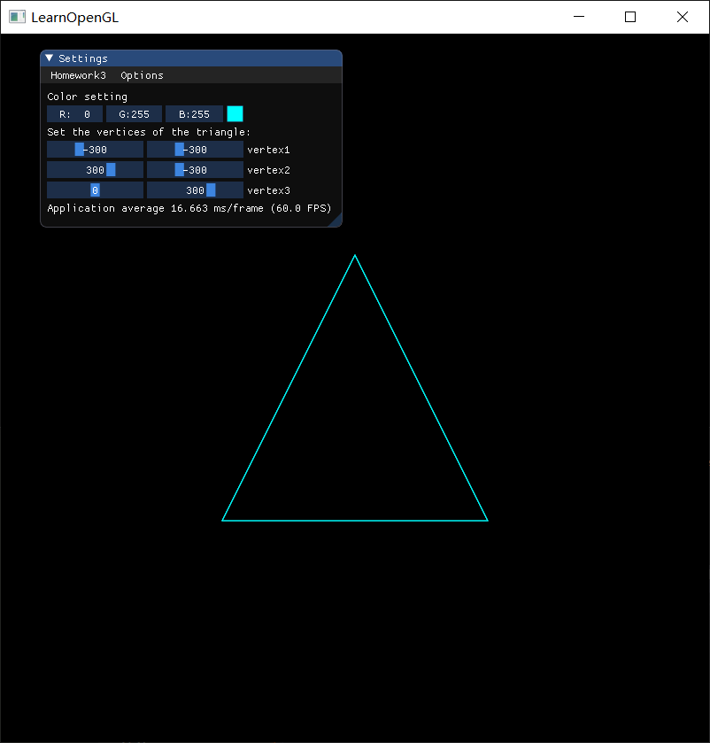
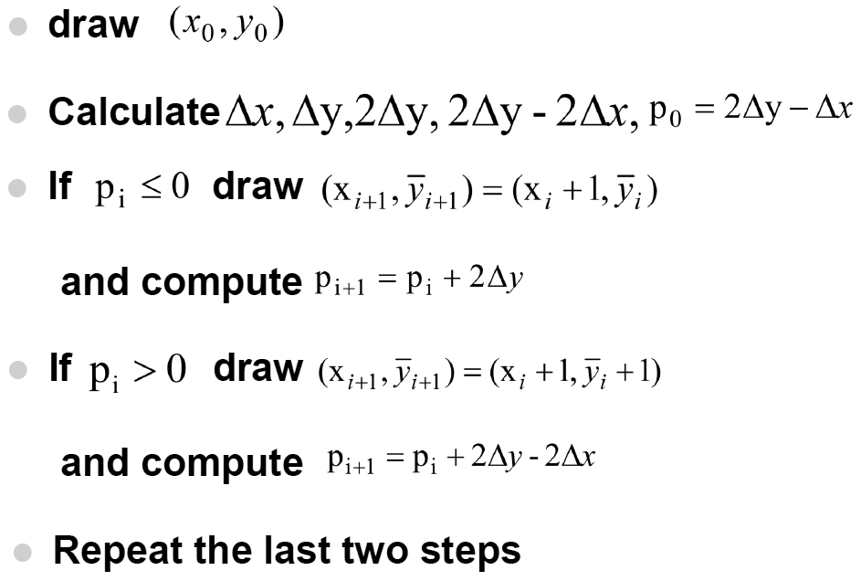
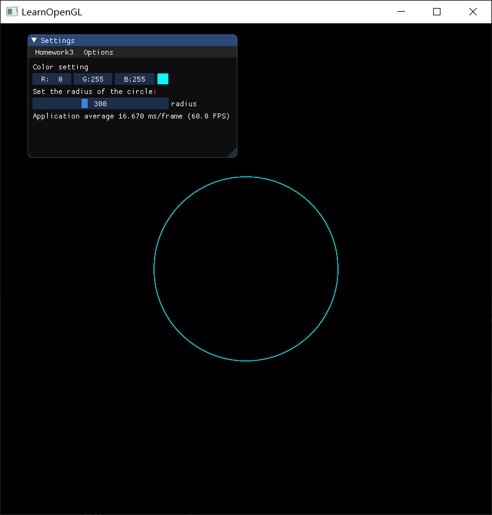
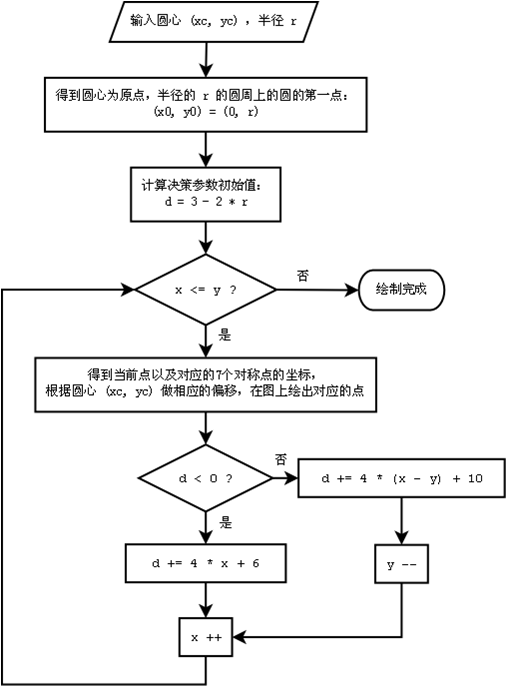
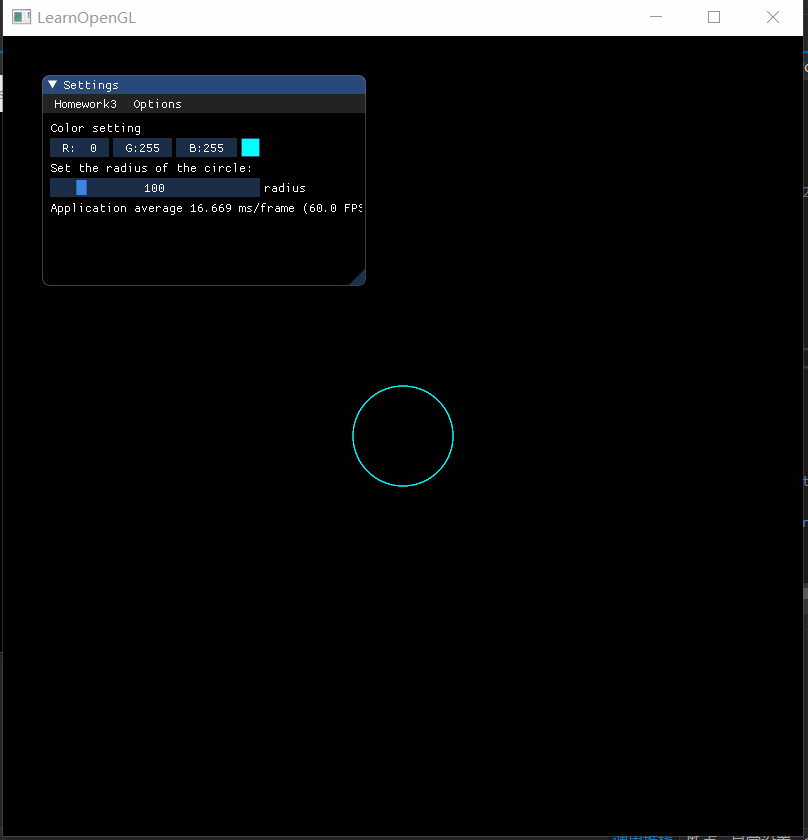
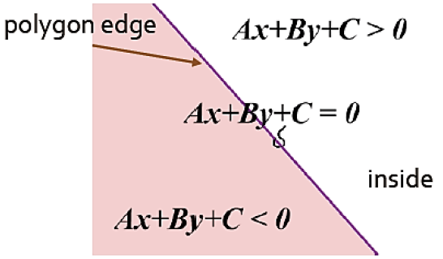

# Homework 3 - Draw line

## 1 Basic

### 1.1 Bresenham 算法画三角形

> 使用Bresenham算法(只使用integer arithmetic)画一个三角形边框：input为三个2D点；output三条直线（要求图元只能用GL_POINTS ，不能使用其他，比如GL_LINES 等）。

#### 1.1.1 结果图

可以通过 ImGui 调整三角形的顶点位置与三角形的颜色：



#### 1.1.2 算法步骤



上面的算法步骤是线与 x 轴夹角是小于 45 度的情况，实现时，要分直线与x轴夹角是否大于45度这两个情况来做。下面是这部分的主要代码，可以看出Bresenham算法非常高效，只涉及整数的加法运算。

```c++
std::vector<int> Utility::getBresenhamLinePoints(int x0, int y0, int x1, int y1) const
{
	std::vector<int> points;
	int dx = abs(x1 - x0), dy = abs(y1 - y0);
	const bool steep = dy > dx;
	if (steep) {
		std::swap(x0, y0);
		std::swap(x1, y1);
		std::swap(dx, dy);
	}
	const int ix = x1 - x0 > 0 ? 1 : -1;
	const int iy = y1 - y0 > 0 ? 1 : -1;
	int x = x0, y = y0;
	const int delta_p1 = 2 * dy;
	const int delta_p2 = 2 * (dy - dx);
	int p = 2 * dy - dx;

	while (x != x1) {
		if (p < 0) {
			p += delta_p1;
		}
		else {
			y += iy;
			p += delta_p2;
		}
		x += ix;
		steep ? setPixel(points, y, x) : setPixel(points, x, y);
	}
	return points;
}
```


### 1.2 Bresenham 算法画圆

> 使用Bresenham算法(只使用integer arithmetic)画一个圆：input为一个2D点(圆心)、一个integer半径；output为一个圆。

#### 1.2.1 结果图

可以通过 ImGui 调整圆的半径：



#### 1.2.2 算法步骤

参考博客：

* [Bresenham 画圆算法原理](https://blog.csdn.net/sinat_41104353/article/details/82961824)

* [Bresenham直线算法与画圆算法](https://www.cnblogs.com/wlzy/p/8695226.html)

Bresenham画圆算法的流程图（图片来自[Bresenham直线算法与画圆算法](https://www.cnblogs.com/wlzy/p/8695226.html)）：



该部分的主要代码：

```c++
std::vector<int> Utility::getBresenhamCirclePoints(const int x0, const int y0, const int r) const
{
	std::vector<int> points;
	int x = 0, y = r, p = 3 - 2 * r;
	while (x <= y) {
		getCircleEightPoints(x0, y0, x, y, points);
		if (p < 0) {
			p += 4 * x + 6;
		}
		else {
			p += 4 * (x - y) + 10;
			y--;
		}
		x++;
	}
	return points;
}

void Utility::getCircleEightPoints(const int x0, const int y0, const int x, const int y, std::vector<int> &points) const
{
	setPixel(points, x0 + x, y0 + y);
	setPixel(points, x0 + x, y0 - y);
	setPixel(points, x0 - x, y0 + y);
	setPixel(points, x0 - x, y0 - y);
	setPixel(points, x0 + y, y0 + x);
	setPixel(points, x0 + y, y0 - x);
	setPixel(points, x0 - y, y0 + x);
	setPixel(points, x0 - y, y0 - x);
}
```


### 1.3 ImGui 调整圆的大小

> 在GUI在添加菜单栏，可以选择是三角形边框还是圆，以及能调整圆的大小(圆心固定即可)。

结果图：



方法：在 ImGui 菜单栏里添加一个 slider 来获取半径

```c++
ImGui::SliderInt("radius", &radius, 0, (int)IGLFW::SCR_HEIGHT);
```


## 2 Bonus

### 2.1 三角形光栅转换算法

使用三角形光栅转换算法，用和背景不同的颜色，填充你的三角形。

#### 2.1.1 结果图

#### 2.1.2 算法步骤

（1）由三角形三个顶点的坐标 $(x_0, y_0), (x_1,y_1), (x_2, y_2)$，计算三条边的直线方程。

由两点坐标 $(x_0, y_0), (x_1,y_1)$  可列出点斜式直线方程：

$$
y-y_0=\frac{y_0-y_1}{x_0-x_1}(x-x_0)
$$
化成一般式直线方程 $Ax+By+C=0$ ：
$$
(y_0-y_1)x+(x_1-x_0)y+(x_0y_1-x_1y_0)=0
$$
所以，
$$
A=y_0-y_1\\
B=x_1-x_0\\
C=x_0y_1-x_1y_0
$$
然后，要使直线负半空间都是三角形外部的点，方法如下：代入第三个顶点 $(x_2, y_2)$ 到直线方程中，若结果小于0，则将直线方程的系数 $A, B, C​$ 乘以负一。



重复上面步骤，得到3条直线方程。

（2）对于三角形的外接长方形的每一个点，分别代入3条直线方程中，如果有一个方程小于0，则该点在三角形外；否则该点在三角形内，设置该点的像素 (set pixel)。

主要代码：

```c++
std::vector<int> Utility::getRasterizedTrianglePoints(const int x0, const int y0, const int x1, const int y1, const int x2, const int y2) const
{
	std::vector<int> points;
	int x_min = std::min(x0, std::min(x1, x2));
	int y_min = std::min(y0, std::min(y1, y2));
	int x_max = std::max(x0, std::max(x1, x2));
	int y_max = std::max(y0, std::max(y1, y2));
	std::vector<std::vector<int>> equations = { getEdgeEquation(x0, y0, x1, y1, x2, y2), getEdgeEquation(x0, y0, x2, y2, x1, y1), getEdgeEquation(x2, y2, x1, y1, x0, y0) };
	for (int x = x_min; x <= x_max; x++) {
		for (int y = y_min; y <= y_max; y++) {
			bool inside = true;
			for (int i = 0; i < (int)equations.size(); i++) {
				if (equations[i][0] * x + equations[i][1] * y + equations[i][2] < 0) {
					inside = false;
					break;
				}
			}
			if (inside) {
				setPixel(points, x, y);
			}
		}
	}
	return points;
}

std::vector<int> Utility::getEdgeEquation(const int x0, const int y0, const int x1, const int y1, const int x2, const int y2) const
{
	std::vector<int> params;
	int A = y0 - y1, B = x1 - x0, C = x0 * y1 - x1 * y0;
	if (A * x2 + B * y2 + C < 0) {
		A *= -1; B *= -1; C *= -1;
	}
	params.push_back(A); params.push_back(B); params.push_back(C);
	return params;
}
```