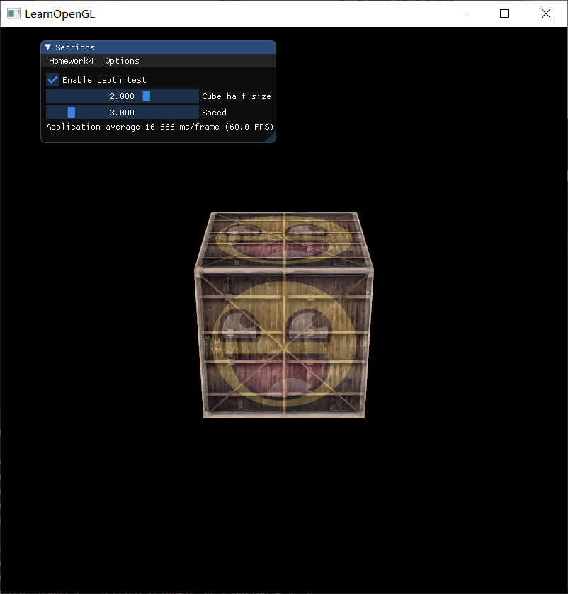
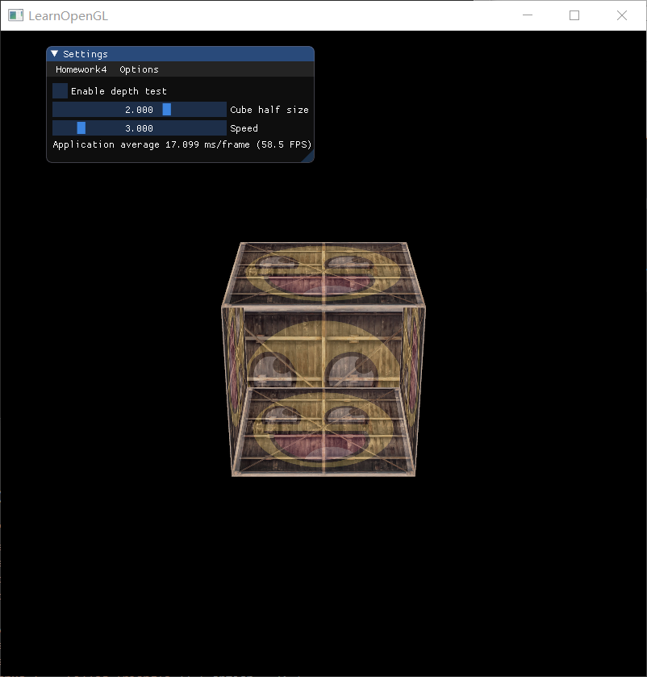
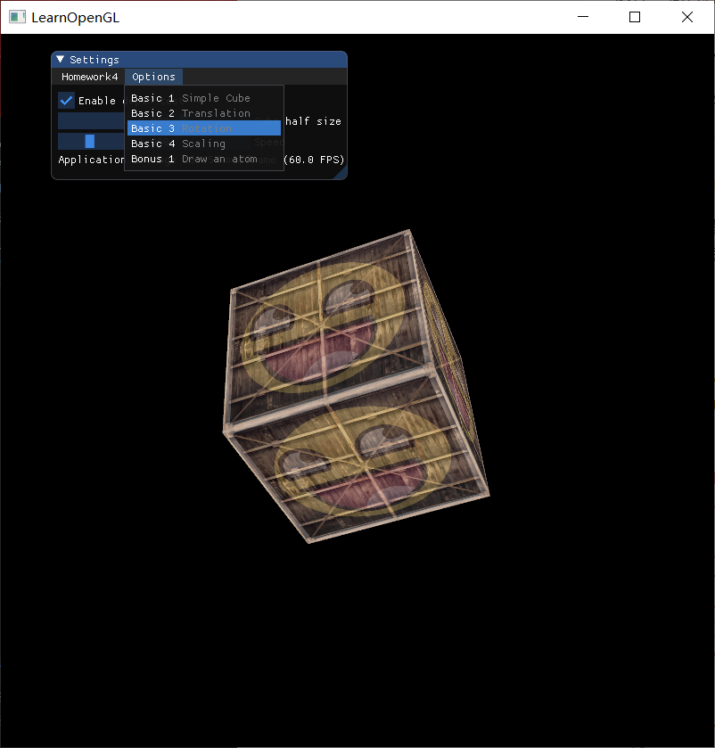
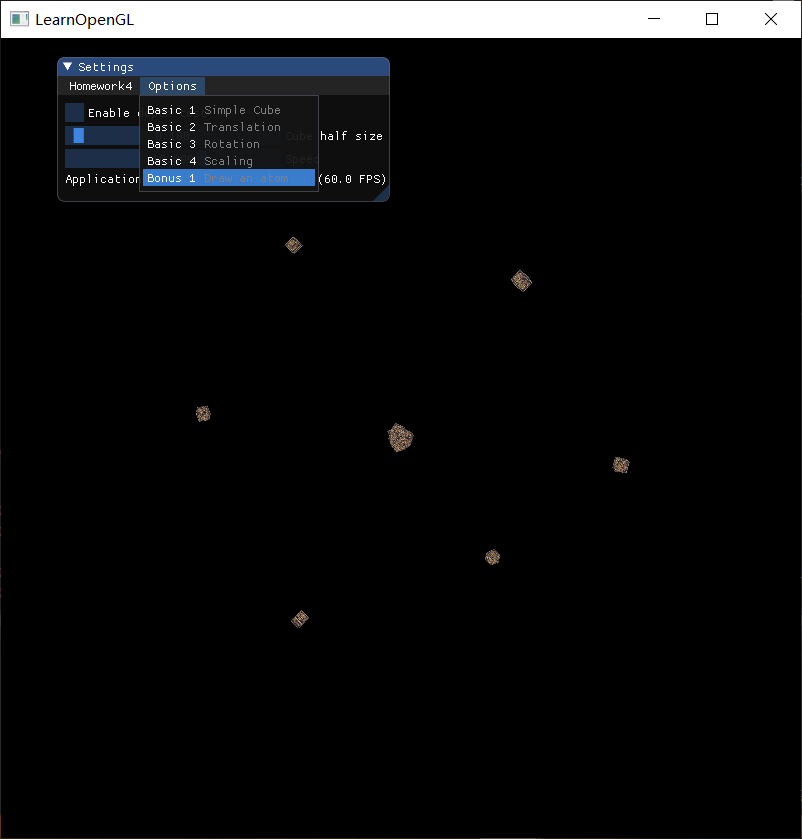
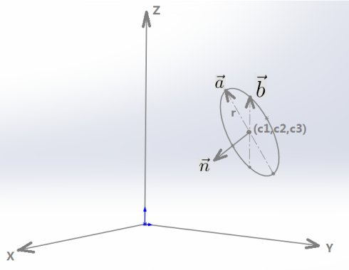

# Homework 4 - Transformation

主要代码封装在 `Transformation` 类中


## 1 Basic

### 1.1 画立方体

> 画一个立方体(cube)：边长为4， 中心位置为(0, 0, 0)。分别启动和关闭深度测试`glEnable(GL_DEPTH_TEST) `、`glDisable(GL_DEPTH_TEST) `，查看区别，并分析原因。

参考：

* [纹理 - LearnOpenGL](https://learnopengl-cn.github.io/01%20Getting%20started/06%20Textures/)
* [变换 - LearnOpenGL](https://learnopengl-cn.github.io/01%20Getting%20started/07%20Transformations/)
* [坐标系统 - LearnOpenGL](https://learnopengl-cn.github.io/01%20Getting%20started/08%20Coordinate%20Systems/)

**实现步骤：**

(1) 在渲染循环前，使用`std_image.h`库加载好所需的纹理图片，并使用OpenGL生成纹理。

(2) 然后，要定义好三个重要的矩阵，分别是`model`, `view`, `projection`

观察 (view) 矩阵定义如下，设置好摄像机的位置和方向，并将它传入着色器：

```c++
view = glm::lookAt(glm::vec3(0.0f, 8.0f, 16.0f), glm::vec3(0.0f, 0.0f, 0.0f), glm::vec3(0.0f, 1.0f, 0.0f));
MyGLFW::getInstance()->ourShader->setMat4("view", view);
```

这样的摄像机是从后上方`(0.0f, 8.0f, 16.0f)`，俯视坐标中心`(0.0f, 0.0f, 0.0f)`的，从下面cube的图可以看到这个效果。

我们希望在场景中使用透视投影，所以要定义如下投影 (projection) 矩阵并将它传入着色器：

```c++
projection = glm::perspective(glm::radians(45.0f), (float)MyGLFW::getInstance()->getScrWidth() / (float)MyGLFW::getInstance()->getScrHeight(), 0.1f, 100.0f);
MyGLFW::getInstance()->ourShader->setMat4("projection", projection);
```

对于模型 (model) 矩阵，这个模型矩阵包含了位移、缩放与旋转操作，它们会被应用到所有物体的顶点上，以变换它们到全局的世界空间。首先将它初始化成单位矩阵，然后在渲染循环中，根据各种需要来使用model矩阵进行位移、缩放与旋转操作，并将它传入着色器。

于是，在顶点着色器程序`shader.vs`中，顶点的位置是这样确定的：

```
gl_Position = projection * view * model * vec4(aPos, 1.0);
```

(3) 定义好`vertices`数组，并配置顶点的位置和纹理属性。因为cube有6个面，每个面可以由2个三角形组成，每个三角形有3个点，所以`vertices`数组共有36个顶点。

(4) 绘制cube：

```c++
glDrawArrays(GL_TRIANGLES, 0, 36);
```

**分别启动和关闭深度测试：**

<table>
    <tr>
        <td ><center>glEnable(GL_DEPTH_TEST)</center></td>
        <td ><center>glDisable(GL_DEPTH_TEST)</center></td>
    </tr>
</table>

**分析原因：**

如果关闭深度测试，如右图，画面很奇怪，立方体的某些本应被遮挡住的面被绘制在了这个立方体其他面之上。之所以这样是因为OpenGL是一个三角形一个三角形地来绘制你的立方体的，所以即便之前那里有东西它也会覆盖之前的像素。因为这个原因，有些三角形会被绘制在其它三角形上面，虽然它们本不应该是被覆盖的

OpenGL存储它的所有深度信息于一个**Z缓冲**(Z-buffer)中，也被称为**深度缓冲**(Depth Buffer)。GLFW会自动为你生成这样一个缓冲（就像它也有一个颜色缓冲来存储输出图像的颜色）。深度值存储在每个片段里面（作为片段的**z**值），当片段想要输出它的颜色时，OpenGL会将它的深度值和z缓冲进行比较，如果当前的片段在其它片段之后，它将会被丢弃，否则将会覆盖。这个过程称为**深度测试**(Depth Testing)，它是由OpenGL自动完成的。

在OpenGL中，深度测试默认是关闭的，因此我们要通过`glEnable`函数来开启深度测试：

```c++
glEnable(GL_DEPTH_TEST);
```

因为我们使用了深度测试，我们也想要在每次渲染迭代之前清除深度缓冲（否则前一帧的深度信息仍然保存在缓冲中）。就像清除颜色缓冲一样，我们可以通过在`glClear`函数中指定`DEPTH_BUFFER_BIT`位来清除深度缓冲：

```c++
glClear(GL_COLOR_BUFFER_BIT | GL_DEPTH_BUFFER_BIT);
```

这样，运行程序后就能看到左图了。


### 1.2 平移、旋转、放缩

> 平移(Translation)：使画好的cube沿着水平或垂直方向来回移动。
>
> 旋转(Rotation)：使画好的cube沿着XoZ平面的x=z轴持续旋转。
>
> 放缩(Scaling)：使画好的cube持续放大缩小。

要让cube随着时间推移平移、旋转、放缩等，可以通过`glfwGetTime()`来获取时间，然后使用时间来进行对应的变换。如果我们想cube来回移动，只需使用`sin`函数即可。如果想cube持续放大缩小，直接使用`sin(t)`会使cube被翻转，这是因为`sin`函数会出现负值，因此只需保证`scale`函数里的向量是正值就行了，如下所示。

主要代码：

```c++
// create transformations
glm::mat4 model = glm::mat4(1.0f);
const float time = speed * (float)glfwGetTime();
const float sint = std::sin(time);
switch (option) {
	case 2: model = glm::translate(model, glm::vec3(3.0f * sint, 0.0f, 0.0f)); break;	// Translation
	case 3: model = glm::rotate(model, time, glm::vec3(1.0f, 0.0f, 1.0f)); break;	// Rotation
	case 4: model = glm::scale(model, glm::vec3(1.0f + sint, 1.0f + sint, 1.0f + sint)); break;	// Scaling
	default: break;
}

// set matrix
MyGLFW::getInstance()->ourShader->setMat4("model", model);
// render
glDrawArrays(GL_TRIANGLES, 0, 36);
```


### 1.3 ImGui

> 在GUI里添加菜单栏，可以选择各种变换。

点击下拉菜单Option的按钮，可以按题号切换要渲染的内容。




### 1.4 渲染管线

> 结合Shader谈谈对渲染管线的理解

在OpenGL中，所有的物体都存在于3D空间中，但是屏幕确实2D的像素数组，于是OpenGL的大部分工作就是将3D坐标转为适应屏幕的2D像素点。而这个过程（3D坐标转成2D坐标的处理过程）是由OpenGL的图形渲染管线（Graphics Pipeline）来管理的。

图形渲染管线可以划分为两个主要部分：

* 将3D坐标转为2D坐标
* 将2D坐标转为实际有颜色的像素

首先回顾一下图形渲染管线的每个阶段所做的重要事情：


在上面流程中，每个阶段将会把前一个阶段的输出作为输入。所有这些阶段都是高度专门化的（它们都有一个特定的函数），并且很容易并行执行，正是因为这个特性，通常显卡有成千上万个小处理核心，它们在GPU上为每一个（渲染管线）阶段运行各自的小程序，在图形渲染管线上快速处理数据。这些小程序叫做着色器 (Shader)。

其中，顶点shader发生在顶点变换阶段，是图形渲染管线的第一部分，把顶点数据（顶点坐标）转为另一种3D坐标，通过顶点shader可以修改一些基本的图元属性，颜色，光照等。

图元装配阶段的输出会传递给几何着色器(Geometry Shader)。几何着色器把图元形式的一系列顶点的集合作为输入，它可以通过产生新顶点构造出新的（或是其它的）图元来生成其他形状。我们还可以在几何Shader中输入多个顶点，对于每个顶点输出不同语义的图元 (Primitive)。

片段着色器的主要目的是计算一个像素的最终颜色，这也是所有OpenGL高级效果产生的地方。通常，片段着色器包含3D场景的数据（比如光照、阴影、光的颜色等等），这些数据可以被用来计算最终像素的颜色。


## 2 Bonus

> 将以上三种变换相结合，打开你们的脑洞，实现有创意的动画。比如：地球绕太阳转等。

### 2.1 画一个原子

（效果见演示视频）



使用cube画了一个原子 (Atom)，其中

* 原子核在中心，有6个质子/中子，随着时间不停快速地随机扰动
* 电子有6个，分别绕着3个圆形轨道运行

**画法：**

首先获取时间`t`，然后计算`sint`和`cost`，给出电子运行的半径`r`，计算`rsint`和`rcost`，如下：

```c++
const float time = speed * (float)glfwGetTime();
const float sint = std::sin(time);
const float cost = std::cos(time);

const float r = 4.0f;
const float rsint = r * sint;
const float rcost = r * cost;
```

对于原子核来说，比较简单，质子/种子不停地随机扰动：

```c++
// Atomic nucleus (neutrons, protons)
model = glm::translate(glm::mat4(1.0f), size * glm::vec3(std::sin(random()), std::sin(random()), std::sin(random())));
model = glm::rotate(model, time, glm::vec3(std::sin(random()), std::sin(random()), std::sin(random())));
MyGLFW::getInstance()->ourShader->setMat4("model", model);
glDrawArrays(GL_TRIANGLES, 0, 36);
```

对于电子，要围绕3个圆形轨道来运行，这就需要找到这三个圆的参数方程了。

对于三维空间中的圆参数方程，参考：[三维空间中圆的参数方程](http://blog.sina.com.cn/s/blog_6496e38e0102vi7e.html)



（上图来自：[三维空间中圆的参数方程](http://blog.sina.com.cn/s/blog_6496e38e0102vi7e.html)）

如图，在三维空间中，设圆 $C(c_1,c_2,c_3)​$，圆心为 $(c_1,c_2,c_3)​$，$\vec{n}​$ 是这个圆的法向量，$\vec{a}=(a_1,a_2,a_3), \vec{b}=(b_1,b_2,b_3)​$ 是垂直于 $\vec{n}​$ 且互相垂直的任意单位向量。则圆的参数方程为：
$$
x(t)=c_1+rcos(t)a_1+rsin(t)b_1\\
y(t)=c_2+rcos(t)a_2+rsin(t)b_2\\
z(t)=c_3+rcos(t)a_3+rsin(t)b_3
$$
然而，OpenGL中的世界坐标系为：


只需令 $X=y, Y=z, Z=x$ 就可以了。

主要代码如下：

```c++
// 定义轨道参数
cubeTransParams.push_back(glm::vec3(1.0f, 0.0f, 1.0f));
cubeTransParams.push_back(glm::vec3(-1.0f, 0.0f, -1.0f));
cubeTransParams.push_back(glm::vec3(-0.5f, 0.5f * std::sqrt(3), 1.0f));
// Electrons
model = glm::translate(glm::mat4(1.0f), glm::vec3(rcost, rcost, rsint) * cubeTransParams[i]);
model = glm::rotate(model, time, cubeTransParams[i]);
MyGLFW::getInstance()->ourShader->setMat4("model", model);
glDrawArrays(GL_TRIANGLES, 0, 36);
```

