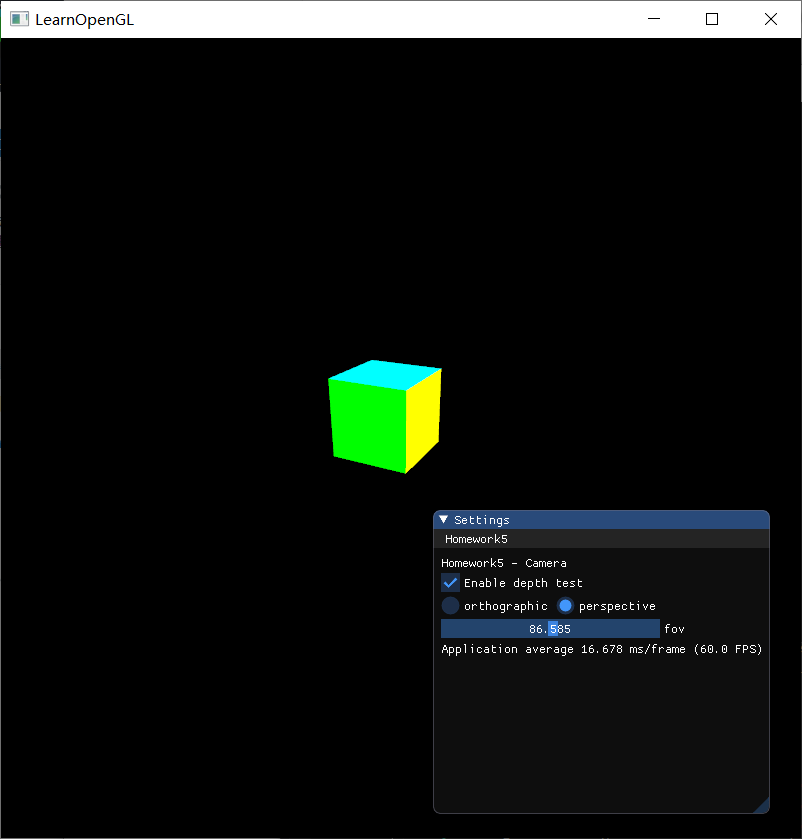

# Homework 5 - Camera

主要代码在 `MyGLFW`，`Camera`，`CameraOperation` 这三个类中。


## 1 Basic

### 1.1 投影 (Projection)

* 把上次作业绘制的cube放置在(-1.5, 0.5, -1.5)位置，要求6个面颜色不一致

* 正交投影(orthographic projection)：实现正交投影，使用多组(left, right, bottom, top, near, far)参数，比较结果差异

* 透视投影(perspective projection)：实现透视投影，使用多组参数，比较结果差异

#### 实现思路与结果

在OpenGL中，为了将坐标从一个坐标系变换到另一个坐标系，我们需要用到几个变换矩阵，最重要的几个分别是模型(Model)、观察(View)、投影(Projection)三个矩阵。

在顶点着色器程序`shader.vs`中，顶点的位置是这样确定的：

```
gl_Position = projection * view * model * vec4(aPos, 1.0);
```

当我们要绘制一个3D物体，首先要做的是定义一个模型(model)矩阵，这个模型矩阵包含了位移、缩放与旋转操作，它们会被应用到所有物体的顶点上，以变换它们到全局的世界空间。首先将它初始化成单位矩阵，然后在渲染循环中，根据各种需要来使用model矩阵进行位移、缩放与旋转操作，并将它传入着色器。

模型矩阵定义如下：

```c++
// 首先创建一个单位矩阵model
glm::mat4 model = glm::mat4(1.0f);
// 然后使用translate函数，将模型移动到所需的位置，即(-1.5f, 0.5f, -1.5f)
model = glm::translate(model, glm::vec3(-1.5f, 0.5f, -1.5f));
// 传入着色器
...
```

观察矩阵定义如下，设置好摄像机的位置和方向，并将它传入着色器：

```c++
view = glm::lookAt(glm::vec3(8.0f, 8.0f, 16.0f), glm::vec3(0.0f, 0.0f, 0.0f), glm::vec3(0.0f, 1.0f, 0.0f));
// 传入着色器
...
```

从后面的结果图可以看到，这个摄像机位于cube的斜上方，离摄像机最近的是cube的一个顶点。

接下来，要定义投影矩阵。由投影矩阵创建的观察箱(Viewing Box)被称为平截头体(Frustum)，每个出现在平截头体范围内的坐标都会最终出现在用户的屏幕上。当物体在平截头体的空间里面时，屏幕就会显示出来，否则不会显示。将观察坐标变换为裁剪坐标的投影矩阵可以为两种不同的形式，每种形式都定义了不同的平截头体。我们可以选择创建一个正射投影矩阵(Orthographic Projection Matrix)或一个透视投影矩阵(Perspective Projection Matrix)。

**正射投影**

正射投影矩阵定义了一个类似立方体的平截头箱，它定义了一个裁剪空间，在这空间之外的顶点都会被裁剪掉。创建一个正射投影矩阵需要指定可见平截头体的宽、高和长度。它的平截头体看起来像一个容器：


要创建一个正射投影矩阵，我们可以使用GLM的内置函数`glm::ortho`：

```
projection = glm::ortho(left, right, bottom, top, near, far);
```

这个函数共有6个参数，`left, right`指定了平截头体的左右坐标，`bottom, top`指定了平截头体的底部和顶部，通过这四个参数我们定义了近平面和远平面的大小。`near, far`定义了近平面和远平面的距离。

正交投影以及调整参数的结果：

<table>
    <tr>
        <td><center>正交投影</center></td>
        <td><center>增大left</center></td>
        <td><center>增大right</center></td>
    </tr>
    <tr>
        <td><center>减小top</center></td>
        <td><center>增大near</center></td>
        <td><center>减小far</center></td>
    </tr>
</table>

可以看到，当增大`left`时，cube向左移动，并发生拉伸。这是因为平截头体的左平面向右移动了，逐渐向cube靠近，至于为什么发生拉伸，是因为这里的窗口是800*800的正方形窗口，而现在的平截头体的近平面/远平面已经不是正方形了，所以发生了拉伸。

当增大`rigth`时，cube向左移动，发生压缩拉伸，此时平截头体的右平面向右移动，逐渐远离cube，与增大`left`同理，现在的平截头体的近平面/远平面已经不是正方形了，所以发生了拉伸。

对于left, right, top, bottom其他变换的原理相同。

`near, far`定义了近平面和远平面的距离。当这两个参数变化时，如果cube的一些部分超出了近平面或远平面之间的空间，即cube的某些部分不在平截头体内，将会被裁减掉，不会显示出来。

**透视投影**

透视投影符合我们实际生活中的视觉效果，近的东西看起来会比较大，越远的东西看起来越小，即“近大远小”。

透视投影的平截头体如下所示：


在GLM中可以这样创建一个透视投影矩阵：

```c++
glm::mat4 projection = glm::perspective(glm::radians(45.0f), (float)width/(float)height, 0.1f, 100.0f);
```

它的第一个参数定义了fov的值，它表示的是视野(Field of View)，并且设置了观察空间的大小。如果想要一个真实的观察效果，它的值通常设置为45.0f，但想要一个末日风格的结果你可以将其设置一个更大的值。第二个参数设置了宽高比，由视口的宽除以高所得。第三和第四个参数设置了平截头体的近和远平面。我们通常设置近距离为0.1f，而远距离设为100.0f。所有在近平面和远平面内且处于平截头体内的顶点都会被渲染。

透视投影 (baseline) 以及调整参数的结果

<table>
    <tr>
        <td><center>透视投影</center></td>
        <td><center>减小fov</center></td>
        <td><center>增大fov</center></td>
    </tr>
</table>


可以看出，减小fov时，视野减小，所以窗口中显示的cube会看起来比较大；增大fov时，视野增大，cube看起来较小。


### 1.2 视角变换 (View Changing)

把cube放置在(0, 0, 0)处，做透视投影，使摄像机围绕cube旋转，并且时刻看着cube中心

#### 实现思路与结果

使摄像机一直处于一个圆的位置，使用以下公式：

```c++
camPosX=sin(clock()/1000.0)*Radius;
camPosZ=cos(clock()/1000.0)*Radius;
```

原理很容易理解，由于圆的公式 $a^2+b^2=1$ ，以及有 $sin^2x+cos^2x=1$ ，所以能保证摄像机在XoZ平面的
一个圆上。

在这部分，观察矩阵和投影矩阵定义如下：

```c++
const float time = speed * (float)glfwGetTime();
const float sint = std::sin(time);
const float cost = std::cos(time);
const float camera_radius = 16.0f;
view = glm::lookAt(glm::vec3(sint * camera_radius, 0.0f, cost * camera_radius), glm::vec3(0.0f, 0.0f, 0.0f), glm::vec3(0.0f, 1.0f, 0.0f));
projection = glm::perspective(glm::radians(45.0f), (float)MyGLFW::getInstance()->getScrWidth() / (float)MyGLFW::getInstance()->getScrHeight(), 0.1f, 100.0f);
```

效果见演示视频。

<table>
    <tr>
        <td><center></center></td>
        <td><center></center></td>
        <td><center></center></td>
    </tr>
</table>


### 1.3 ImGui

在GUI里添加菜单栏，可以选择各种功能。

效果见演示视频。


### 1.4 

在现实生活中，我们一般将摄像机摆放的空间 **View matrix** 和被拍摄的物体摆设的空间 **Model matrix** 分开，但
是在OpenGL中却将两个合二为一设为 **ModelView matrix**，通过上面的作业启发，你认为是为什么呢？在报
告中写入。（Hints：你可能有不止一个摄像机）

图形管道通常涉及从 model space 到 world space、从 world space 到 view space 以及从 view space 到 clip space 的转换。存在一个转换矩阵，将这几个变换矩阵都组合到一起（分别是 world、view 和 projection 变换）。

因为每个转换都是一个矩阵，所以可以组合它们：可以创建 model-view 矩阵或 view-projection 矩阵，甚至可以创建单个组合的 model-view-projection 矩阵。它们都是完全合理的，事实上在适当的时候使用得相当普遍。

在经典的图形管道理论和 OpenGL 固定管线里，将 model-to-world 和 world-to-view 结合被认为是标准实践。这样做是因为在 view space 中有一个非常常见的原因：它简化了照明效果的计算。


## 2 Bonus

### 2.1 Camera 类

实现一个camera类，当键盘输入`w,a,s,d` ，能够前后左右移动；当移动鼠标，能够视角移动("look around")，
即类似FPS(First Person Shooting)的游戏场景

#### 实现思路与结果

首先，要实验一个`Camera`类，它能处理各种输入事件，如键盘输入、鼠标输入等，并会计算对应的观察(view)矩阵，并可以返回到主程序中，传送到着色器，实现键盘、鼠标控制场景移动。

`Camera`类的头文件如下：

```c++
class Camera
{
public:
	enum CameraMovement { FORWARD, BACKWARD, LEFT, RIGHT };
	
	// Constructor with vectors
	Camera(glm::vec3 position = glm::vec3(0.0f, 0.0f, 16.0f), glm::vec3 up = glm::vec3(0.0f, 1.0f, 0.0f), float yaw = YAW, float pitch = PITCH);
	// Constructor with scalar values
	Camera(float posX, float posY, float posZ, float upX, float upY, float upZ, float yaw, float pitch);
	~Camera();
	void reset();
	float getZoom() const { return zoom; };

	// Returns the view matrix calculated using Euler Angles and the LookAt Matrix
	glm::mat4 getViewMatrix() const;
	// Processes input received from any keyboard-like input system. Accepts input parameter in the form of camera defined ENUM (to abstract it from windowing systems)
	void processKeyBoard(const CameraMovement direction, const float deltaTime);
	// Processes input received from a mouse input system. Expects the offset value in both the x and y direction.
	void processMouseMovement(float xoffset, float yoffset, GLboolean constrainPitch = true);
	// Processes input received from a mouse scroll-wheel event. Only requires input on the vertical wheel-axis
	void processMouseScroll(float yoffset);

private:
	// Default camera values
	static const float YAW;
	static const float PITCH;
	static const float SPEED;
	static const float SENSITIVITY;
	static const float ZOOM;

	// Camera Attributes
	glm::vec3 position;
	glm::vec3 front;
	glm::vec3 up;
	glm::vec3 right;
	glm::vec3 worldUp;
	// Euler Angles
	float yaw;
	float pitch;
	// Camera options
	float movementSpeed;
	float mouseSensitivity;
	float zoom;

	// used for reset to the init state
	glm::vec3 init_position;
	glm::vec3 init_up;
	float init_yaw;
	float init_pitch;

	// Calculates the front vector from the Camera's (updated) Euler Angles
	void updateCameraVectors();
};
```

然后，修改之前写好的`processInput`函数，添加检查按键的命令，当键盘对应的键被按下后，camera就会做相应的处理，并更新camera的参数，如摄像机位置、`yaw`和`pitch`等，并重新计算观察矩阵：

```c++
void MyGLFW::processInput(GLFWwindow * window)
{
	if (glfwGetKey(window, GLFW_KEY_ESCAPE) == GLFW_PRESS) glfwSetWindowShouldClose(window, true);
	if (glfwGetKey(window, GLFW_KEY_W) == GLFW_PRESS) MyGLFW::camera.processKeyBoard(Camera::FORWARD, deltaTime);
	if (glfwGetKey(window, GLFW_KEY_S) == GLFW_PRESS) MyGLFW::camera.processKeyBoard(Camera::BACKWARD, deltaTime);
	if (glfwGetKey(window, GLFW_KEY_A) == GLFW_PRESS) MyGLFW::camera.processKeyBoard(Camera::LEFT, deltaTime);
	if (glfwGetKey(window, GLFW_KEY_D) == GLFW_PRESS) MyGLFW::camera.processKeyBoard(Camera::RIGHT, deltaTime);
	if (glfwGetKey(window, GLFW_KEY_LEFT_CONTROL)) MyGLFW::resetCamera();
}
```

在这里我添加了`GLFW_KEY_LEFT_CONTROL`（即左Ctrl键）的输入事件，用来重置camera。使用键盘和鼠标在场景中移动时，只需按一下左Ctrl键，就会回到初始的视图。实现重置camera的方法是，在`Camera`的的构造函数中，记录好初始参数，然后在`reset`函数中，将各种参数赋值为之前记录的初始参数，并重新计算摄像机的`front, right, up`参数，并更新观察矩阵。

要使用鼠标对场景进行控制，就要注册一个处理鼠标事件的回调函数：

```c++
void MyGLFW::mouse_callback(GLFWwindow * window, double xpos, double ypos)
{
	if (MyGLFW::firstMouse) {
		MyGLFW::lastX = (float)xpos;
		MyGLFW::lastY = (float)ypos;
		MyGLFW::firstMouse = false;
	}
	float xoffset = (float)xpos - lastX;
	float yoffset = lastY - (float)ypos; // reversed since y-coordinates go from bottom to top
	MyGLFW::lastX = (float)xpos;
	MyGLFW::lastY = (float)ypos;
	camera.processMouseMovement(xoffset, yoffset);
}
```

最后再添加一个内容，就是用鼠标的滚轮来放大缩小场景。与鼠标移动、键盘输入一样，需要一个鼠标滚轮的回调函数，通过回调函数来调整投影矩阵的fov，就可以实现这样的效果：

```c++
// 鼠标滚轮回调函数
void MyGLFW::scroll_callback(GLFWwindow * window, double xoffset, double yoffset)
{
	camera.processMouseScroll((float)yoffset);
}

// Camera类处理鼠标滚轮的函数
void Camera::processMouseScroll(float yoffset)
{
	if (zoom > 1.0f && zoom <= 45.0f) zoom -= yoffset;
	if (zoom <= 1.0f) zoom = 1.0f;
	if (zoom >= 45.0f) zoom = 45.0f;
}

// 在渲染循环中，根据Camera类的zoom数值来设置投影矩阵的fov
projection = glm::perspective(glm::radians(MyGLFW::getInstance()->camera.getZoom()), (float)MyGLFW::getInstance()->getScrWidth() / (float)MyGLFW::getInstance()->getScrHeight(), 0.1f, 100.0f);
```

最后效果见演示视频。