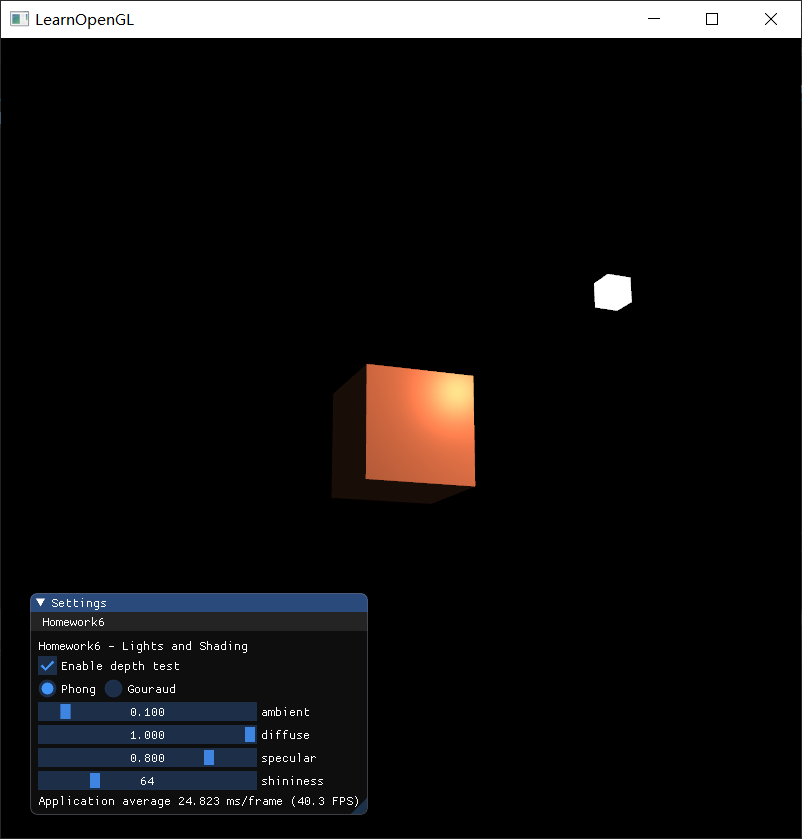
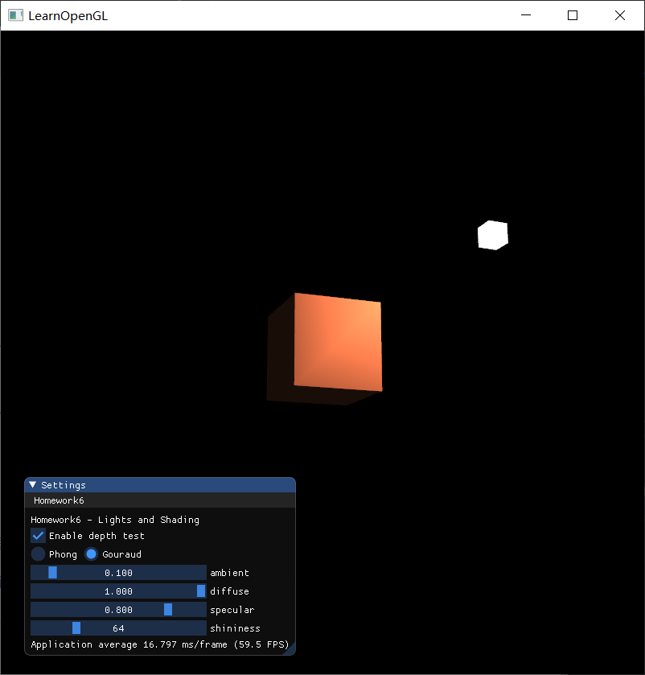
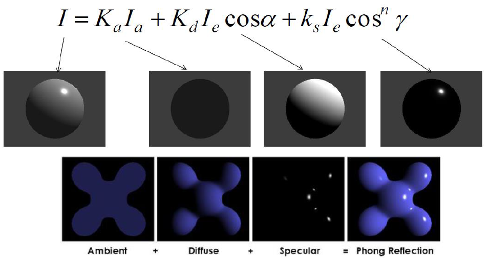
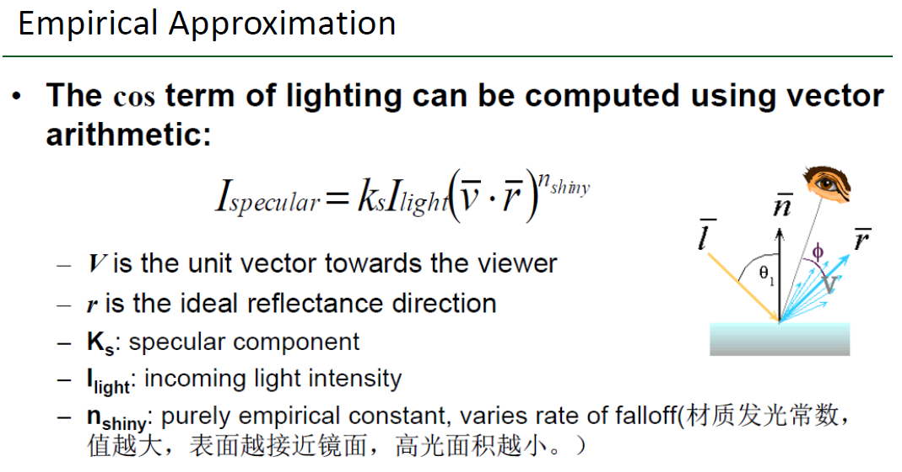

# Homework 6 - Lights and Shading

> **Introduction**
>
> 本次作业要求大家自己编写shader，实现Phong光照模型，在场景中添加局部光照(Phong Shading / Gouraud Shading)。同时，要求调节不同的参数，观察不同的光照效果。

主要代码在 `Lighting` 类中，着色器代码在 `GLSL` 文件夹中，分别是 `lighting.vs, lighting.fs` 和 `lamp.vs, lamp.fs` 。


## 1 Basic

### 1.1 Phong光照模型

> 实现Phong光照模型
>
> * 场景中绘制一个cube
> * **自己写shader**实现两种shading: Phong Shading 和 Gouraud Shading，并解释两种shading的实现原理
> * 合理设置视点、光照位置、光照颜色等参数，使光照效果明显显示

#### 效果图

<table>
    <tr>
        <td><center>Phong</center></td>
        <td><center>Gouraud</center></td>
    </tr>
</table>

#### 实现原理

##### Phong Shading

在现实世界中，光照是非常复杂的，会收到很多因素的影响，这是我们优先的计算能力所无法模拟的。因此在实践中通常会使用一些简化的模型，对现实的光照进行模拟，大大降低了计算量，并且看起来还是比较真实的。而其中一个模型被称为冯氏光照模型(Phong Lighting Model)。冯氏光照模型的主要结构由3个分量组成：环境(Ambient)、漫反射(Diffuse)和镜面(Specular)光照。下面这张图展示了这些光照分量看起来的样子：


用公式来表示 Phong 模型，就是将这三个分量加起来：



###### 环境光照(Ambient Lighting)

即使在黑暗的情况下，世界上通常也仍然有一些光亮（月亮、远处的光），所以物体几乎永远不会是完全黑暗的。为了模拟这个，我们会使用一个环境光照常量，它永远会给物体一些颜色。

光通常都不是来自于同一个光源，而光的一个属性是，它可以向很多方向发散并反弹，光照射到一个物体的表面，经过反弹后，又对另一个物体产生影响。考虑到这种情况的算法叫做全局照明(Global Illumination)算法，但是显然它的计算代价高昂。

因此我们会使用一个简单的照明模型，即环境光照，使用一个很小的常量（光照）颜色，添加到物体片段的最终颜色中。用光的颜色乘以一个很小的常量环境因子，再乘以物体的颜色，然后将最终结果作为片段的颜色：

```c++
void main()
{
    float ambientStrength = 0.1;
    vec3 ambient = ambientStrength * lightColor;

    vec3 result = ambient * objectColor;
    FragColor = vec4(result, 1.0);
}
```

###### 漫反射光照(Diffuse Lighting)

模拟光源对物体的方向性影响(Directional Impact)。它是冯氏光照模型中视觉上最显著的分量。物体的某一部分越是正对着光源，它就会越亮。漫反射光照与观察者的位置无关，与光线方向和物体表面的法向量的夹角有关。

漫反射光照，可以根据朗伯余弦定理 (Lambert's Cosine Law) 来计算。

> *Lambert's Cosine Law*
>
> The energy reflected by a small portion of a surface from a light source in a given direction is proportional to the cosine of the angle between that direction and the surface normal.

因此，计算漫反射光照需要：

- 法向量：一个垂直于顶点表面的向量。
- 定向的光线：作为光源的位置与片段的位置之间向量差的方向向量。为了计算这个光线，我们需要光的位置向量和片段的位置向量。

光线方向 (从片段到光源) 的向量与法向量的夹角越小，余弦值越大，从而该片段会越亮，这个余弦值可以通过向量点乘来获得，如下所示。注意用于计算这个余弦值的向量必须进行标准化。

```c++
// diffuse
vec3 norm = normalize(Normal);
vec3 lightDir = normalize(lightPos - FragPos);
float diff = max(dot(norm, lightDir), 0.0);
vec3 diffuse = diffuseStrength * diff * lightColor;
```

###### 镜面光照(Specular Lighting)

模拟有光泽物体上面出现的亮点。镜面光照的颜色相比于物体的颜色会更倾向于光的颜色。

和漫反射光照一样，镜面光照也是依据光的方向向量和物体的法向量来决定的，但是它也依赖于观察方向，例如玩家是从什么方向看着这个片段的。

对于镜面光照，使用以下公式来计算：



在着色器程序中：

```c++
// specular
vec3 viewDir = normalize(viewPos - FragPos);
vec3 reflectDir = reflect(-lightDir, norm);  
float spec = pow(max(dot(viewDir, reflectDir), 0.0), shininess);
vec3 specular = specularStrength * spec * lightColor; 
```

其中，使用 `reflect` 函数来计算反射光线的向量。

 `reflect` 函数要求第一个向量是从光源指向片段位置的向量，但是`lightDir`当前正好相反，是从片段指向光源（由先前我们计算`lightDir`向量时，减法的顺序决定）。为了保证我们得到正确的`reflect`向量，我们通过对`lightDir`向量取反来获得相反的方向。第二个参数要求是一个法向量，所以我们提供的是已标准化的`norm`向量。

**Phong 模型**

最后，把上面三种光照加起来，就得到 Phong 光照模型：

```c++
// ambiant
vec3 ambient = ambientStrength * lightColor;

// diffuse
vec3 norm = normalize(Normal);
vec3 lightDir = normalize(lightPos - FragPos);
float diff = max(dot(norm, lightDir), 0.0);
vec3 diffuse = diffuseStrength * diff * lightColor;

// specular
vec3 viewDir = normalize(viewPos - FragPos);
vec3 reflectDir = reflect(-lightDir, norm);  
float spec = pow(max(dot(viewDir, reflectDir), 0.0), shininess);
vec3 specular = specularStrength * spec * lightColor; 

vec3 result = (ambient + diffuse + specular) * objectColor;
FragColor = vec4(result, 1.0f);
```

##### Gouraud Shading

在光照着色器的早期，开发者曾经在顶点着色器中实现冯氏光照模型。在顶点着色器中做光照的优势是，相比片段来说，顶点要少得多，因此会更高效，所以（开销大的）光照计算频率会更低。然而，顶点着色器中的最终颜色值是仅仅只是那个顶点的颜色值，片段的颜色值是由插值光照颜色所得来的。结果就是这种光照看起来不会非常真实，除非使用了大量顶点。

在顶点着色器中实现的冯氏光照模型叫做Gouraud着色(Gouraud Shading)，而不是冯氏着色(Phong Shading)。由于插值，这种光照看起来有点逊色。冯氏着色能产生更平滑的光照效果。

总结一下两种 Shading 模型：

* Gouraud Shading 在顶点着色器中实现。它对每个顶点来计算冯氏光照，然后通过插值来计算片段的颜色值。
* Phong Shading 在片段着色器中实现。它对每个像素点来计算冯氏光照。

在顶点着色器中，计算冯氏光照得到顶点的颜色，然后传给片段着色器：

```c++
Normal = mat3(transpose(inverse(model))) * aNormal;

// gouraud shading
// ------------------------
vec3 Position = vec3(model * vec4(aPos, 1.0));

// ambient
vec3 ambient = ambientStrength * lightColor;

// diffuse 
vec3 norm = normalize(Normal);
vec3 lightDir = normalize(lightPos - Position);
float diff = max(dot(norm, lightDir), 0.0);
vec3 diffuse = diffuseStrength * diff * lightColor;

// specular
vec3 viewDir = normalize(viewPos - Position);
vec3 reflectDir = reflect(-lightDir, norm);  
float spec = pow(max(dot(viewDir, reflectDir), 0.0), shininess);
vec3 specular = specularStrength * spec * lightColor;      

// pass LightingColor to fragment shader
LightingColor = ambient + diffuse + specular;
```


### 1.2 ImGui调节参数

> 使用GUI，使参数可调节，效果实时更改：
>
> * GUI里可以切换两种shading
> * 使用如进度条这样的控件，使ambient因子、diffuse因子、specular因子、反光度等参数可调节，光照效果实时更改

#### 实现思路与结果

实现效果见演示视频。

方法：

* 使用 ImGui 的 `RadioButton` 控件来切换两种 shading，并通过 `uniform` 变量传入着色器中，告诉着色器应该使用哪种 shading
* 使用 ImGui 的 `SliderFloat, SliderInt` 控件来调节 ambient 因子、diffuse 因子、specular 因子、反光度等参数，并通过 `uniform` 变量传入着色器中进行计算


## 2 Bonus

### 2.1 光源来回移动

> 当前光源为静止状态，尝试使光源在场景中来回移动，光照效果实时更改。

#### 实现思路与结果

实现效果见演示视频。

方法：使用 `glfwGetTime()` 和 `sin` 函数，使光源在 cube 前面来回移动：

```c++
float speed = 2.0f;
this->lightPos = glm::vec3(sin(speed * glfwGetTime()) * 2.0f, sin(speed * glfwGetTime() / 2.0f), 2.0f);
```

