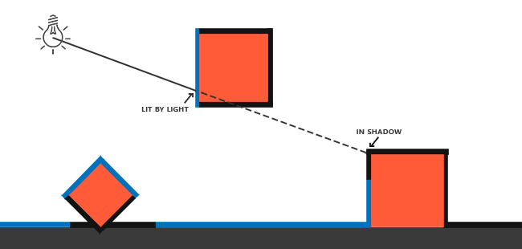

# Homework 7 - Shadowing Mapping

> **Introduction**
>
> 相信大家在课堂上也体会到阴影对场景渲染真实性的重要性。本次作业大家将要实现 Shadowing Mapping，并尽可能去优化。本次作业量较大，也希望大家能在彻底理解 Shadowing Mapping 的算法后再开始编程实现。

主要代码在 `ShadowMapping` 类中，着色器代码在 `GLSL` 文件夹中，分别是 `shadow_mapping_depth.vs, shadow_mapping_depth.fs` 和 `shadow_mapping.vs, shadow_mapping.fs` 。

[TOC]

## 1 Basic

> 1. 实现方向光源的 Shadowing Mapping:
>    * 要求场景中至少有一个 object 和一块平面 (用于显示 shadow)
>    * 光源的投影方式任选其一即可
>    * 在报告里结合代码，解释 Shadowing Mapping 算法
> 2. 修改GUI

### 1.1 实现结果

实现结果见演示视频

<table>
    <tr>
        <td><center>角度1</center></td>
        <td><center>角度2</center></td>
    </tr>
</table>

### 1.2 实现方法

#### 1.2.1 Shadow Mapping 算法原理

阴影映射(Shadow Mapping)背后的思路非常简单：我们以光的位置为视角进行渲染，我们能看到的东西都将被点亮，看不见的一定是在阴影之中了。假设有一个地板，在光源和它之间有一个大盒子。由于光源处向光线方向看去，可以看到这个盒子，但看不到地板的一部分，这部分就应该在阴影中了。如下图所示：



在深度测试中，在深度缓冲里的一个值是摄像机视角下，对应于一个片元的一个0到1之间的深度值。于是，我们可以从光源的透视图来渲染场景，并把深度值的结果储存到纹理中。通过这种方式，我们就能对光源的透视图所见的最近的深度值进行采样。最终，深度值就会显示从光源的透视图下见到的第一个片元了。我们管储存在纹理中的所有这些深度值，叫做深度贴图（depth map）或阴影贴图。


左侧的图片展示了一个定向光源（所有光线都是平行的）在立方体下的表面投射的阴影。通过储存到深度贴图中的深度值，我们就能找到最近点，用以决定片元是否在阴影中。我们使用一个来自光源的视图和投影矩阵来渲染场景就能创建一个深度贴图。这个投影和视图矩阵结合在一起成为一个 $T$ 变换，它可以将任何三维位置转变到光源的可见坐标空间。

在右边的图中我们显示出同样的平行光和观察者。 我们渲染一个点 $\bar{\color{red}{P}}$ 处的片元，需要决定它是否在阴影中。我们先得使用 $T$ 把 $\bar{\color{red}{P}}$ 变换到光源的坐标空间里。既然点 $\bar{\color{red}{P}}$ 是从光的透视图中看到的，它的z坐标就对应于它的深度，例子中这个值是0.9。使用点 $\bar{\color{red}{P}}$ 在光源的坐标空间的坐标，我们可以索引深度贴图，来获得从光的视角中最近的可见深度，结果是点 $\bar{\color{green}{C}}$ ，最近的深度是0.4。因为索引深度贴图的结果是一个小于点 $\bar{\color{red}{P}}$ 的深度，我们可以断定 $\bar{\color{red}{P}}$ 被挡住了，它在阴影中了。

深度映射由两个步骤组成：

* 以光源视角渲染场景，得到深度贴图 (depth map) ，并存储为 texture
* 像往常一样，以 camera 视角渲染场景，使用 Shadow Mapping 算法 (比较当前深度值与在 depth map texture 的深度值)，决定某个点是否在阴影下

#### 1.2.2 Step1 生成深度贴图

第一步我们需要生成一张深度贴图(Depth Map)。深度贴图是从光的透视图里渲染的深度纹理，用它计算阴影。因为我们需要将场景的渲染结果储存到一个纹理中，我们将再次需要帧缓冲。

首先，我们要为渲染的深度贴图创建一个帧缓冲对象。然后，创建一个2D纹理，提供给帧缓冲的深度缓冲使用：

```c++
// configure depth map FBO
// -----------------------
glGenFramebuffers(1, &depthMapFBO);
// create depth texture
glGenTextures(1, &depthMap);
glBindTexture(GL_TEXTURE_2D, depthMap);
glTexImage2D(GL_TEXTURE_2D, 0, GL_DEPTH_COMPONENT, SHADOW_WIDTH, SHADOW_HEIGHT, 0, GL_DEPTH_COMPONENT, GL_FLOAT, NULL);
glTexParameteri(GL_TEXTURE_2D, GL_TEXTURE_MIN_FILTER, GL_NEAREST);
glTexParameteri(GL_TEXTURE_2D, GL_TEXTURE_MAG_FILTER, GL_NEAREST);
glTexParameteri(GL_TEXTURE_2D, GL_TEXTURE_WRAP_S, GL_CLAMP_TO_BORDER);
glTexParameteri(GL_TEXTURE_2D, GL_TEXTURE_WRAP_T, GL_CLAMP_TO_BORDER);
GLfloat borderColor[] = { 1.0f, 1.0f, 1.0f, 1.0f };
glTexParameterfv(GL_TEXTURE_2D, GL_TEXTURE_BORDER_COLOR, borderColor);
// attach depth texture as FBO's depth buffer
glBindFramebuffer(GL_FRAMEBUFFER, depthMapFBO);
glFramebufferTexture2D(GL_FRAMEBUFFER, GL_DEPTH_ATTACHMENT, GL_TEXTURE_2D, depthMap, 0);
glDrawBuffer(GL_NONE);
glReadBuffer(GL_NONE);
glBindFramebuffer(GL_FRAMEBUFFER, 0);
```

接下来，在渲染循环里，从光源的视角来渲染深度贴图 (depth map)，并保存到深度贴图纹理 (depth map texture)。

要从光源的视角来渲染深度贴图，就要各种物体变换到光源视角的空间。由下面的 `lightSpaceMatrix` 乘以物体的顶点，就可以得到物体光源视角的空间的坐标。

```c++
glm::mat4 lightProjection, lightView;
glm::mat4 lightSpaceMatrix;
float near_plane = 1.0f, far_plane = 7.5f;

// 选择光源投影方式，正交投影 或 透视投影
if (MyGLFW::hw7_shadow_projection_type == 0) lightProjection = glm::ortho(-10.0f, 10.0f, -10.0f, 10.0f, near_plane, far_plane);
else lightProjection = glm::perspective(glm::radians(90.0f), (GLfloat)this->SHADOW_WIDTH / (GLfloat)this->SHADOW_HEIGHT, 1.0f, 25.0f);

lightView = glm::lookAt(this->lightPos, glm::vec3(0.0f), glm::vec3(0.0, 1.0, 0.0));
lightSpaceMatrix = lightProjection * lightView;
```

将 `lightSpaceMatrix` 传到顶点着色器 `simpleDepthShader.vs` 中去：

```c++
// render scene from light's point of view
this->simpleDepthShader->use();
this->simpleDepthShader->setMat4("lightSpaceMatrix", lightSpaceMatrix);
```

顶点着色器 `simpleDepthShader.vs` 的内容如下，它的工作是使用 `lightSpaceMatrix` 把顶点变换到光空间：

```c++
#version 330 core
layout (location = 0) in vec3 aPos;

uniform mat4 lightSpaceMatrix;
uniform mat4 model;

void main()
{
    gl_Position = lightSpaceMatrix * model * vec4(aPos, 1.0);
}
```

由于我们没有颜色缓冲，最后的片元不需要任何处理，所以我们可以简单地使用一个空像素着色器 `simpleDepthShader.fs` ，它什么也不干：

```c++
#version 330 core

void main()
{
}
```

现在就可以从光源的视角来渲染深度贴图了：

```c++
// 1. render depth of scene to texture (from light's perspective)
// --------------------------------------------------------------
glCullFace(GL_FRONT);
glViewport(0, 0, this->SHADOW_WIDTH, this->SHADOW_HEIGHT);
glBindFramebuffer(GL_FRAMEBUFFER, this->depthMapFBO);
glClear(GL_DEPTH_BUFFER_BIT);
glActiveTexture(GL_TEXTURE0);
glBindTexture(GL_TEXTURE_2D, this->woodTexture);
renderScene(this->simpleDepthShader);
glBindFramebuffer(GL_FRAMEBUFFER, 0);
glCullFace(GL_BACK);
```

其中，`renderScene` 函数的工作是设置场景中各种物体的模型矩阵，它内容如下：

```c++
void ShadowMapping::renderScene(const Shader * shader)
{
	// floor
	glm::mat4 model = glm::mat4(1.0f);
	shader->setMat4("model", model);
	glBindVertexArray(this->planeVAO);
	glDrawArrays(GL_TRIANGLES, 0, 6);
	// cubes
	model = glm::mat4(1.0f);
	model = glm::translate(model, glm::vec3(0.0f, 1.5f, 0.0f));
	model = glm::scale(model, glm::vec3(0.5f));
	shader->setMat4("model", model);
	renderCube();
	model = glm::mat4(1.0f);
	model = glm::translate(model, glm::vec3(2.0f, 0.0f, 1.0f));
	model = glm::scale(model, glm::vec3(0.5f));
	shader->setMat4("model", model);
	renderCube();
	model = glm::mat4(1.0f);
	model = glm::translate(model, glm::vec3(-1.0f, 0.0f, 2.0f));
	model = glm::rotate(model, glm::radians(60.0f), glm::normalize(glm::vec3(1.0f, 0.0f, 1.0f)));
	model = glm::scale(model, glm::vec3(0.25f));
	shader->setMat4("model", model);
	renderCube();
}
```


#### 1.2.3 Step2 利用深度贴图来渲染场景

从上面步骤，我们得到了深度贴图，现在就可以根据深度贴图来渲染场景了。

用于渲染场景的顶点着色器和片段着色器程序分别是 `shadow_mapping.vs` 和  `shadow_mapping.fs`。

在顶点着色器中，需要使用 `lightSpaceMatrix` 把顶点变换到光空间，然后传给片段着色器：

```c++
#version 330 core
layout (location = 0) in vec3 aPos;
layout (location = 1) in vec3 aNormal;
layout (location = 2) in vec2 aTexCoords;

out vec2 TexCoords;

out VS_OUT {
    vec3 FragPos;
    vec3 Normal;
    vec2 TexCoords;
    vec4 FragPosLightSpace;
} vs_out;

uniform mat4 projection;
uniform mat4 view;
uniform mat4 model;
uniform mat4 lightSpaceMatrix;

void main()
{
    vs_out.FragPos = vec3(model * vec4(aPos, 1.0));
    vs_out.Normal = transpose(inverse(mat3(model))) * aNormal;
    vs_out.TexCoords = aTexCoords;
    vs_out.FragPosLightSpace = lightSpaceMatrix * vec4(vs_out.FragPos, 1.0);
    gl_Position = projection * view * model * vec4(aPos, 1.0);
}
```

片段着色器使用 Blinn-Phong 光照模型渲染场景。它使用下面的 `ShadowCalculation` 函数计算出一个shadow值，当fragment在阴影中时是1.0，在阴影外是0.0。然后，diffuse和specular颜色会乘以这个阴影元素。由于阴影不会是全黑的（由于散射），我们把ambient分量从乘法中剔除。

片段着色器的内容如下：

```c++
#version 330 core
out vec4 FragColor;

in VS_OUT {
    vec3 FragPos;
    vec3 Normal;
    vec2 TexCoords;
    vec4 FragPosLightSpace;
} fs_in;

uniform sampler2D diffuseTexture;
uniform sampler2D shadowMap;

uniform vec3 lightPos;
uniform vec3 viewPos;

float ShadowCalculation(vec4 fragPosLightSpace)
{
    [...]
}

void main()
{           
    vec3 color = texture(diffuseTexture, fs_in.TexCoords).rgb;
    vec3 normal = normalize(fs_in.Normal);
    vec3 lightColor = vec3(1.0);
    // ambient
    vec3 ambient = 0.3 * color;
    // diffuse
    vec3 lightDir = normalize(lightPos - fs_in.FragPos);
    float diff = max(dot(lightDir, normal), 0.0);
    vec3 diffuse = diff * lightColor;
    // specular
    vec3 viewDir = normalize(viewPos - fs_in.FragPos);
    vec3 reflectDir = reflect(-lightDir, normal);
    float spec = 0.0;
    vec3 halfwayDir = normalize(lightDir + viewDir);  
    spec = pow(max(dot(normal, halfwayDir), 0.0), 64.0);
    vec3 specular = spec * lightColor;    
    // calculate shadow
    float shadow = ShadowCalculation(fs_in.FragPosLightSpace);                      
    vec3 lighting = (ambient + (1.0 - shadow) * (diffuse + specular)) * color;    

    FragColor = vec4(lighting, 1.0);
}
```

在 `ShadowCalculation` 函数中，首先要检查一个片元是否在阴影中，把光空间片元位置转换为裁切空间的标准化设备坐标。当我们在顶点着色器输出一个裁切空间顶点位置到gl_Position时，OpenGL自动进行一个透视除法，将裁切空间坐标的范围-w到w转为-1到1，这要将x、y、z元素除以向量的w元素来实现。由于裁切空间的FragPosLightSpace并不会通过gl_Position传到像素着色器里，我们必须自己做透视除法：

```c++
vec3 projCoords = fragPosLightSpace.xyz / fragPosLightSpace.w;
```

返回了片元在光空间的-1到1的范围。

因为来自深度贴图的深度在0到1的范围，我们也打算使用projCoords从深度贴图中去采样，所以我们将NDC坐标变换为0到1的范围：

```c++
projCoords = projCoords * 0.5 + 0.5;
```

有了这些投影坐标，我们就能从深度贴图中采样得到0到1的结果，从第一个渲染阶段的projCoords坐标直接对应于变换过的NDC坐标。我们将得到光的位置视野下最近的深度：

```c++
float closestDepth = texture(shadowMap, projCoords.xy).r;
```

为了得到片元的当前深度，我们简单获取投影向量的z坐标，它等于来自光的透视视角的片元的深度。

```c++
float currentDepth = projCoords.z;
```

实际的对比就是简单检查currentDepth是否高于closetDepth，如果是，那么片元就在阴影中。

完整的 `ShadowCalculation` 函数 (加入了 **阴影偏移** 和 **PCF** ) 的内容如下：

```c++
float ShadowCalculation(vec4 fragPosLightSpace)
{
    // perform perspective divide
    vec3 projCoords = fragPosLightSpace.xyz / fragPosLightSpace.w;
    // transform to [0,1] range
    projCoords = projCoords * 0.5 + 0.5;
    // get closest depth value from light's perspective (using [0,1] range fragPosLight as coords)
    float closestDepth = texture(shadowMap, projCoords.xy).r; 
    // get depth of current fragment from light's perspective
    float currentDepth = projCoords.z;
	// calculate bias (based on depth map resolution and slope)
	vec3 normal = normalize(fs_in.Normal);
    vec3 lightDir = normalize(lightPos - fs_in.FragPos);
    float bias = max(0.05 * (1.0 - dot(normal, lightDir)), 0.005);
    // check whether current frag pos is in shadow
    //float shadow = currentDepth - bias > closestDepth  ? 1.0 : 0.0;
	// PCF
    float shadow = 0.0;
    vec2 texelSize = 1.0 / textureSize(shadowMap, 0);
    for(int x = -1; x <= 1; ++x)
    {
        for(int y = -1; y <= 1; ++y)
        {
            float pcfDepth = texture(shadowMap, projCoords.xy + vec2(x, y) * texelSize).r; 
            shadow += currentDepth - bias > pcfDepth ? 1.0 : 0.0;        
        }    
    }
    shadow /= 9.0;

	// keep the shadow at 0.0 when outside the far_plane region of the light's frustum.
	if (projCoords.z > 1.0)
		shadow = 0.0;

    return shadow;
}
```


## 2 Bonus

### 2.1 实现光源在正交/透视两种投影下的 Shadowing Mapping

#### 2.1.1 实现结果

实现结果见演示视频

* 按下键盘 O 键，切换到光源正交投影
* 按下键盘 P 键，切换到光源透视投影
* 按下键盘 1 键，显示鼠标 cursor
* 按下键盘 2 键，隐藏鼠标 cursor

<table>
    <tr>
        <td><center>光源正交投影 角度1</center></td>
        <td><center>光源透视投影 角度1</center></td>
    </tr>
    <tr>
        <td><center>光源正交投影 角度2</center></td>
        <td><center>光源透视投影 角度2</center></td>
    </tr>
</table>

#### 2.1.2 实现方法

在 `processInput` 函数中，添加下面两条语句，当按下键盘 O 或 P 键时，切换光源投影方式：

```c++
if (glfwGetKey(window, GLFW_KEY_O) == GLFW_PRESS) MyGLFW::hw7_shadow_projection_type = 0;	// orthographic
if (glfwGetKey(window, GLFW_KEY_P) == GLFW_PRESS) MyGLFW::hw7_shadow_projection_type = 1; // perspective
```

在计算 `lightSpaceMatrix` 之前，根据选择，来确定 `lightProjection` 矩阵，再计算 `lightSpaceMatrix` ：

```c++
glm::mat4 lightProjection, lightView;
glm::mat4 lightSpaceMatrix;
float near_plane = 1.0f, far_plane = 7.5f;

// 选择光源投影方式，正交投影 或 透视投影
if (MyGLFW::hw7_shadow_projection_type == 0) lightProjection = glm::ortho(-10.0f, 10.0f, -10.0f, 10.0f, near_plane, far_plane);
else lightProjection = glm::perspective(glm::radians(90.0f), (GLfloat)this->SHADOW_WIDTH / (GLfloat)this->SHADOW_HEIGHT, 1.0f, 25.0f);

lightView = glm::lookAt(this->lightPos, glm::vec3(0.0f), glm::vec3(0.0, 1.0, 0.0));
lightSpaceMatrix = lightProjection * lightView;
```


### 2.2 优化 Shadowing Mapping

#### 2.2.1 阴影失真

如果不做这一步，我们可以看到地板四边形渲染出很大一块交替黑线。这种阴影贴图的不真实感叫做**阴影失真(Shadow Acne)**，下图解释了成因：


因为阴影贴图受限于解析度，在距离光源比较远的情况下，多个片元可能从深度贴图的同一个值中去采样。图片每个斜坡代表深度贴图一个单独的纹理像素。你可以看到，多个片元从同一个深度值进行采样。

我们可以用一个叫做**阴影偏移**（shadow bias）的技巧来解决这个问题，我们简单的对表面的深度（或深度贴图）应用一个偏移量，这样片元就不会被错误地认为在表面之下了。


在 `shadow_mapping.fs` 中，实现阴影偏移：

```c++
float bias = max(0.05 * (1.0 - dot(normal, lightDir)), 0.005);
float shadow = currentDepth - bias > closestDepth  ? 1.0 : 0.0;
```

#### 2.2.2 悬浮

修复悬浮(Peter Panning)的方法是进行正面剔除：

```c++
glCullFace(GL_FRONT);
RenderSceneToDepthMap();
glCullFace(GL_BACK); // 不要忘记设回原先的culling face
```

#### 2.2.3 采样过多

光照有一个区域，超出该区域就成为了阴影；这个区域实际上代表着深度贴图的大小，这个贴图投影到了地板上。发生这种情况的原因是我们之前将深度贴图的环绕方式设置成了GL_REPEAT。让所有超出深度贴图的坐标的深度范围是1.0，这样超出的坐标将永远不在阴影之中。我们可以储存一个边框颜色，然后把深度贴图的纹理环绕选项设置为GL_CLAMP_TO_BORDER：

```c++
glTexParameteri(GL_TEXTURE_2D, GL_TEXTURE_WRAP_S, GL_CLAMP_TO_BORDER);
glTexParameteri(GL_TEXTURE_2D, GL_TEXTURE_WRAP_T, GL_CLAMP_TO_BORDER);
GLfloat borderColor[] = { 1.0, 1.0, 1.0, 1.0 };
glTexParameterfv(GL_TEXTURE_2D, GL_TEXTURE_BORDER_COLOR, borderColor);
```

对于光的视锥不可见的区域，一律被认为是处于阴影中，即使它们不在阴影区域。出现这个状况是因为超出光的视锥的投影坐标比1.0大，这样采样的深度纹理就会超出他默认的0到1的范围。

解决这个问题也很简单，只要投影向量的z坐标大于1.0，我们就把shadow的值强制设为0.0：

```c++
float ShadowCalculation(vec4 fragPosLightSpace)
{
    [...]
    if(projCoords.z > 1.0)
        shadow = 0.0;

    return shadow;
}
```

#### 2.2.4 PCF

因为深度贴图有一个固定的解析度，多个片元对应于一个纹理像素。结果就是多个片元会从深度贴图的同一个深度值进行采样，这几个片元便得到的是同一个阴影，这就会产生锯齿边。如下所示：


其中一个解决方案叫做 PCF（percentage-closer filtering），这是一种多个不同过滤方式的组合，它产生柔和阴影，使它们出现更少的锯齿块和硬边。核心思想是从深度贴图中多次采样，每一次采样的纹理坐标都稍有不同。每个独立的样本可能在也可能不再阴影中。所有的次生结果接着结合在一起，进行平均化，我们就得到了柔和阴影。

一个简单的PCF的实现是简单的从纹理像素四周对深度贴图采样，然后把结果平均起来：

```c++
float shadow = 0.0;
vec2 texelSize = 1.0 / textureSize(shadowMap, 0);
for(int x = -1; x <= 1; ++x)
{
    for(int y = -1; y <= 1; ++y)
    {
        float pcfDepth = texture(shadowMap, projCoords.xy + vec2(x, y) * texelSize).r; 
        shadow += currentDepth - bias > pcfDepth ? 1.0 : 0.0;        
    }    
}
shadow /= 9.0;
```

PCF 优化前后对比图如下所示，可以看出阴影的锯齿已经柔和很多，没有那么生硬了：

<table>
    <tr>
        <td><center>PCF优化前</center></td>
        <td><center>PCF优化后</center></td>
    </tr>
</table>


## 3 References

* [阴影映射](https://learnopengl-cn.github.io/05%20Advanced%20Lighting/03%20Shadows/01%20Shadow%20Mapping/)
* [Shadow Mapping](https://learnopengl.com/Advanced-Lighting/Shadows/Shadow-Mapping)