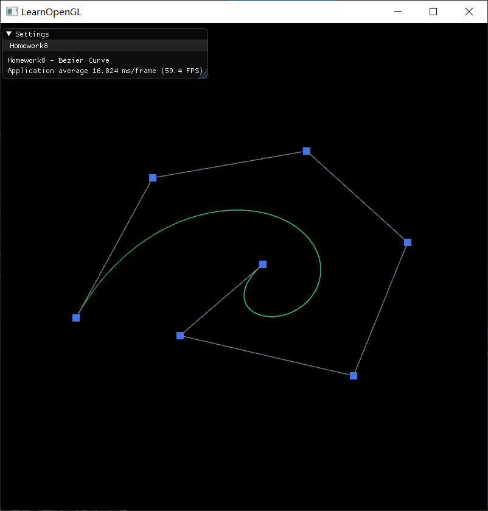
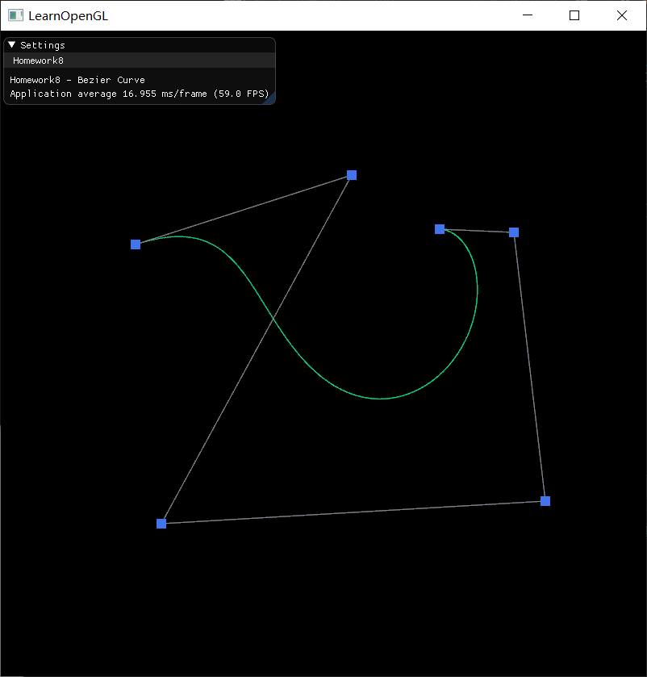
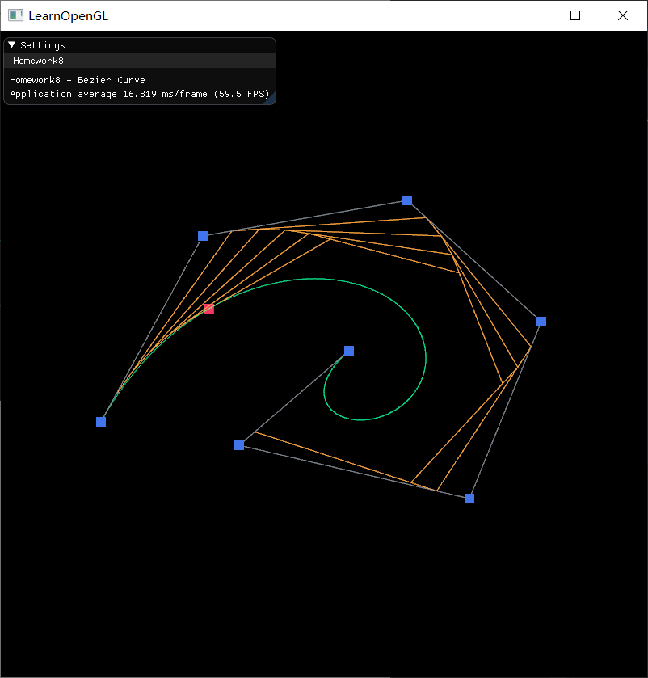
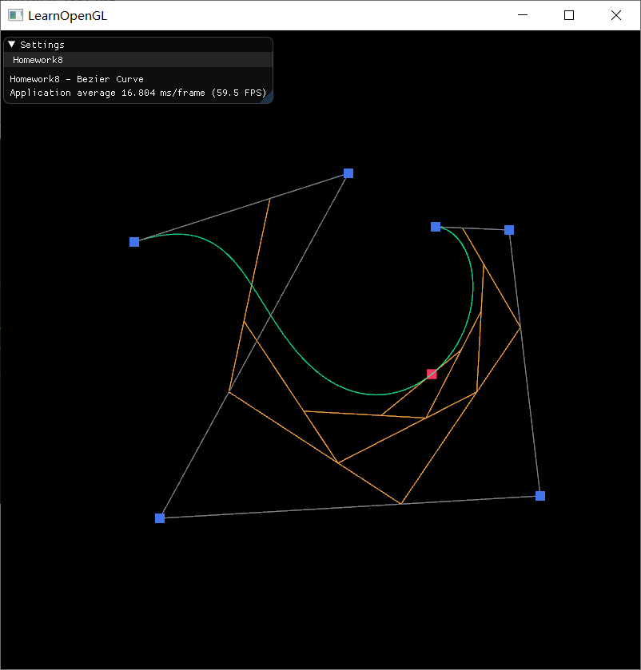

# Homework 8 - Bézier Curve

> **Introduction**
>
> 本次作业要求大家实现一个 Bézier Curve 的绘制小工具。此工具可以接受鼠标输入。

主要代码在 `BezierCurve` 类中

[TOC]

## 1 Basic

> 1. 用户能通过左键点击添加 Bézier 曲线的控制点，右键点击则对当前添加的最后一个控制点进行消除
> 2. 工具根据鼠标绘制的控制点实时更新 Bézier 曲线
> 
> *Hint:* 大家可查询捕捉 mouse 移动和点击的函数方法

### 1.1 实现结果

实现结果见演示视频

<table>
    <tr>
        <td><center></center></td>
        <td><center></center></td>
    </tr>
</table>
### 1.2 实现方法

#### 1.2.1 实现鼠标添加或删除控制点

实现用户能通过左键点击添加 Bézier Curve 的控制点，右键点击则对当前添加的最后一个控制点进行消除。

定义 `mouse_callback` 回调函数，用于实时获取鼠标的当前位置

```c++
void MyGLFW::mouse_callback(GLFWwindow * window, double xpos, double ypos)
{
	BezierCurve::getInstance()->mouse_x = xpos;
	BezierCurve::getInstance()->mouse_y = ypos;
}
```

注册 `mouse_callback` 函数：

```c++
glfwSetCursorPosCallback(this->window, mouse_callback);
```

定义 `mouse_button_callback`  函数，当用户点击鼠标左键时，将控制点压入 (push_back) 到 `ctrlPoints` 容器的末端；当用户点击鼠标右键时，若 `ctrlPoints` 非空，则弹出 (pop_back) 容器内末端的控制点。

这里应该注意的是，`mouse_callback` 获取的鼠标坐标的所在的坐标系，是以窗口左上角为原点、向右为 x 轴正方向、向下为 y 轴正方向的。这还不是 OpenGL 的标准化设备坐标 (NDC)，而后面画控制点时，就要用到 NDC 坐标，所以要做一些转换，将控制点的坐标转成 NDC 坐标。

另外，如果正在显示画图过程 (`isDrawing == true`，在 2.2 中说明)，则不允许增加或删除控制点。

```c++
void MyGLFW::mouse_button_callback(GLFWwindow * window, int button, int action, int mods)
{
    // 如果正在显示画图过程 isDrawing，则不允许增加或删除控制点
	if (action == GLFW_PRESS && !BezierCurve::getInstance()->isDrawing) {
		switch (button)
		{
			case GLFW_MOUSE_BUTTON_LEFT: {
				float x = 2.0f * (float)BezierCurve::getInstance()->mouse_x / (float)MyGLFW::getInstance()->getScrWidth() - 1.0f;
				float y = 1.0f - 2.0f * (float)BezierCurve::getInstance()->mouse_y / (float)MyGLFW::getInstance()->getScrHeight();
				BezierCurve::getInstance()->ctrlPoints.push_back(glm::vec2(x, y));
			} break;
			case GLFW_MOUSE_BUTTON_RIGHT: {
				if (!BezierCurve::getInstance()->ctrlPoints.empty()) {
					BezierCurve::getInstance()->ctrlPoints.pop_back();
				}	
			} break;
			default: break;
		}
	}
}
```

注册 `mouse_button_callback` 函数：

```c++
glfwSetMouseButtonCallback(this->window, mouse_button_callback);
```

#### 1.2.2 实时更新 Bézier Curve

实现根据鼠标绘制的控制点实时更新 Bézier 曲线。

在上一步骤 (1.2.1) 中，已经获取到绘制 Bézier 曲线的控制点了，现在就可以根据这些控制点来画出 Bézier 曲线了。Bézier Curve 本质上是由调和函数 (Harmonic functions) 根据控制点 (Control points) 插值生成。用于绘制 Bézier Curve 的参数方程如下：
$$
Q(t) = \sum_{i=0}^n P_i B_{i,n}(t), \ \ \ t \in [0,1]
$$
上式为 $n$ 次多项式，具有 $n+1$ 项。其中，$P_i (i=0,1...,n)$ 表示特征多边形的 $n+1$ 个顶点向量；$B_{i,n}(t)$ 为伯恩斯坦 (Bernstein) 基函数 ，其多项式表示为：
$$
B_{i,n}(t)=\frac{n!}{i!(n-i)!}t^i(1-t)^{n-i}, \ \ \ i=0,1,...,n
$$
在绘制时，用 `bezierPoints` 存储 Bézier 曲线上的点。在渲染循环中的每次循环，首先把 `bezierPoints` 清空，然后使参数 t 从 0 变化到 1，步长为 0.001，根据上述 Bézier Curve 的参数方程来把每一个点存入 `bezierPoints` 中，最后制作成 `VAO`，并使用 `glDrawArrays ` 将 Bézier Curve 画出来。

绘制的代码如下：

```c++
void BezierCurve::drawBezierCurve()
{
    // 如果控制点数量小于2，不绘制
	if (ctrlPoints.size() < 2)
		return;
    
    // 将bezier曲线上的点存到bezierPoints中
	bezierPoints.clear();
	int n = (int)ctrlPoints.size() - 1;
	for (double t = 0; t <= 1.0; t += 0.001) {
		double x = 0, y = 0;
		for (int i = 0; i <= n; i++) {
			double B = fact(n) / fact(i) / fact(n - i) 
                * pow(t, i) * pow(1.0 - t, n - i);
			x += ctrlPoints[i].x * B;
			y += ctrlPoints[i].y * B;
		}
		bezierPoints.push_back(glm::vec2(x, y));
	}
    
	// 制作VAO、VBO
	glm::vec3 color = this->greenColor;
	float *vertices = new float[bezierPoints.size() * 6];
	for (int i = 0; i < (int)bezierPoints.size(); i++) {
		vertices[i * 6 + 0] = (float)bezierPoints[i].x;
		vertices[i * 6 + 1] = (float)bezierPoints[i].y;
		vertices[i * 6 + 2] = 0.0f;
		vertices[i * 6 + 3] = color.x;
		vertices[i * 6 + 4] = color.y;
		vertices[i * 6 + 5] = color.z;
	}
	processObjects(vertices, bezierPoints.size() * 6 * sizeof(vertices));
    
    // 画出bezier曲线
	glDrawArrays(GL_POINTS, 0, bezierPoints.size());
    
    // 释放资源
	delete[]vertices;
	freeObjects();
}
```


## 2 Bonus

> 可以动态地呈现 Bezier 曲线的生成过程。

### 2.1 实现结果

实现结果见演示视频

当用户选择好控制点后，按下键盘 Enter 键，即可动态地呈现 Bézier 曲线的生成过程。在显示生成的动态过程中，不允许用户新增或删除控制点；当生成过程的演示结束后，用户可以新增或删除控制点。如果在过程中再次按下 Enter 键，可以退出曲线生成的演示。

<table>
    <tr>
        <td><center></center></td>
        <td><center></center></td>
    </tr>
</table>

### 2.2 实现方法

定义键盘回调函数 `key_callback`，用于处理用户按下 Enter 键的操作。用户按下 Enter 键后，将 `isDrawing` 的状态取反，渲染循环中根据 `isDrawing` 来判断是否要绘制曲线生成过程。

如果当前正在演示曲线生成过程 (`isDrawing == true`) ，则将绘制曲线的参数方程的参数 `t` 置为 0。

```c++
void MyGLFW::key_callback(GLFWwindow * window, int key, int scanmode, int action, int mods)
{
	if (action == GLFW_PRESS && key == GLFW_KEY_ENTER) {
		if (BezierCurve::getInstance()->isDrawing) {
			BezierCurve::getInstance()->cur_t = 0.0;
		}
		BezierCurve::getInstance()->isDrawing = !BezierCurve::getInstance()->isDrawing;
	}
}
```

注册这个函数：

```c++
glfwSetKeyCallback(this->window, key_callback);
```

在渲染循环中的每个循环，如果 `isDrawing == true`，若当前 `cur_t <= 1.0`，则绘制在 `cur_t`时刻的曲线生成过程 (`drawProcess` 函数，在下面说明)，并使 `cur_t` 增加 0.002 (当然也可以增加 0.001，这样做只是为了加快演示速度)；否则，将 `isDrawing` 置为 `false` 并将 `cur_t` 置为 `0.0`，曲线生成过程的演示结束：

```c++
// 画出过程 (按enter键)
if (this->isDrawing) {
	if (this->cur_t <= 1.0) {
		drawProcess(this->ctrlPoints, cur_t);
		cur_t += 0.002;
	}
	else {
		this->isDrawing = false;
		cur_t = 0.0;
	}
}
```

根据使用下面的 `drawProcess` 函数，递归绘制出曲线生成过程在 `t ` 时刻的图形。在初始时刻，有 $n+1$ 个控制点，将它们依次两两连线，并在这些连线上分别取比例为 $t$ 的点，即 $P=(1-t)P_i+tP_{i+1}$，得到 $n$ 个点 (储存在 `nextCtrlPoints` 中)，然后再用这 $n$ 个点递归调用 `drawProcess` 函数，进而得到 $n-1$ 个点。当 `nextCtrlPoints` 的数量为 1 时，`nextCtrlPoints` 里面的这个点就是 Bézier 曲线上的点，用红色将它画出来。

```c++
void BezierCurve::drawProcess(const std::vector<glm::vec2>& curCtrlPoints, const double t)
{
    // 如果控制点数量小于2，不绘制
	if (curCtrlPoints.size() < 2)
		return;
	std::vector<glm::vec2> nextCtrlPoints;
	for (int i = 0; i < (int)curCtrlPoints.size() - 1; i++) {
		double x = (1.0 - t) * curCtrlPoints[i].x + t * curCtrlPoints[i + 1].x;
		double y = (1.0 - t) * curCtrlPoints[i].y + t * curCtrlPoints[i + 1].y;
		nextCtrlPoints.push_back(glm::vec2(x, y));
	}
	// 画出Bezier曲线上的点
	if (nextCtrlPoints.size() == 1) {
		drawPoint(nextCtrlPoints[0], 0.03f, this->redColor);
	}
    // 画出辅助线并递归调用drawProcess
	else {
		for (int i = 0; i < (int)nextCtrlPoints.size() - 1; i++) {
			drawLine(nextCtrlPoints[i], nextCtrlPoints[i + 1], this->orangeColor);
		}
		drawProcess(nextCtrlPoints, t);
	}
}
```

